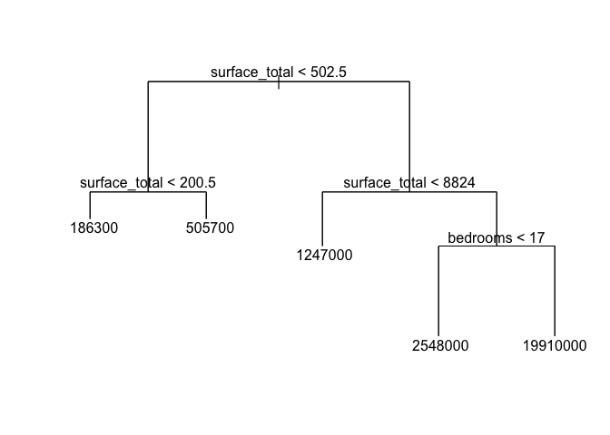
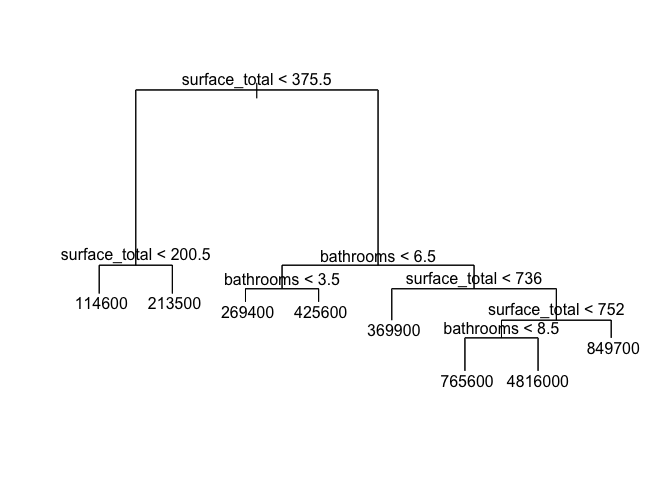

### Introduction

Price of real estate properties are dependent on a number of features such as number of rooms, size of house, and type of property. For example, someone should be ready to pay at least few more hundreds of dollars as monthly rent if he or she is looking to find a house with an additional room. While there are many drivers that can affect the house price, some of the features will have stronger effect than others, and we can use such strong predictors to predict the house price using predictive models. In this report, I will use several different models to analyze the effect of the features on price of house in Peru and Ecuador. Given that the economic and political environment of each country are different, each feature may have different impacts on price. Therefore, I will also compare two countries using relevant housing price data.

### Methodology

1)	Pre-Processing: I will first convert the currency into USD to maintain consistency across price data. Also, ‘0’ values from price data will be removed because it is illogical to have $0 price for houses with rooms. There could have been some error while collecting data. Next, in order to decide which column (feature) to use as price predictors, I will use my own judgment looking at the number of values. To figure out features that could help to predict the price, I will first look into the number of unique values, NA values, and blank values in each column. Then I will remove columns that have too many unique values. I will also remove columns with only one unique values, and columns with many NA and blank values, except for ‘bedroooms’ column since the source of data (Kaggle) specifically mentioned that this column will be useful for all countries other than Argentina. Then, I will split the data into two separate datasets: one for rent price and another for sale price. I will only analyze and predict for-sale price since it had larger sample size.

2)	Train and Test Data: After the pre-processing, I will split the for-sale house price data into training (80%) and testing (20%) sets. I will then use several models on the train and test data, predict the housing price, and calculate the RMSE of each model for easier comparison.

3)	Build model: I will build predictive and interpretable models using various R packages.

4)	Compare two countries: I will compare Peruvian house price and Ecuadorian house price by analyzing models I built.

### Loading Packages


```r
knitr::opts_chunk$set(echo = TRUE, message = FALSE)
library(psych)
library(corrplot)
library(dplyr)
library(caret)
library(class)
library(tree)
```

### Data Description

For the purpose of this project, I used Peruvian and Ecuadorian housing price data sourced from Kaggle. Each dataset consists of a lot of information about real estate listing.


```r
#reading Peruvian housing data
peru = read.csv("pe_properties.csv", header = TRUE, sep = ",", stringsAsFactors = T) 

#reading Ecuadorian dataset
ecuador = read.csv("ec_properties.csv", header = TRUE, sep = ",", stringsAsFactors = T)

#Descriptive statistic of original Peruvian and Ecuadorian data
dim(peru) # the number of rows and columns
```

```
## [1] 124449     25
```

```r
dim(ecuador) # the number of rows and columns
```

```
## [1] 143565     25
```

```r
names(peru) #column names
```

```
##  [1] "id"              "ad_type"         "start_date"      "end_date"       
##  [5] "created_on"      "lat"             "lon"             "l1"             
##  [9] "l2"              "l3"              "l4"              "l5"             
## [13] "l6"              "rooms"           "bedrooms"        "bathrooms"      
## [17] "surface_total"   "surface_covered" "price"           "currency"       
## [21] "price_period"    "title"           "description"     "property_type"  
## [25] "operation_type"
```

```r
names(ecuador) #column names
```

```
##  [1] "id"              "ad_type"         "start_date"      "end_date"       
##  [5] "created_on"      "lat"             "lon"             "l1"             
##  [9] "l2"              "l3"              "l4"              "l5"             
## [13] "l6"              "rooms"           "bedrooms"        "bathrooms"      
## [17] "surface_total"   "surface_covered" "price"           "currency"       
## [21] "price_period"    "title"           "description"     "property_type"  
## [25] "operation_type"
```

```r
str(peru) # shows data structure and variable type of each column
```

```
## 'data.frame':	124449 obs. of  25 variables:
##  $ id             : Factor w/ 124449 levels "//+43i13Vn9FKtdmRxqeXg==",..: 79594 3257 99713 83179 67727 86769 8459 50619 10929 79425 ...
##  $ ad_type        : Factor w/ 1 level "Propiedad": 1 1 1 1 1 1 1 1 1 1 ...
##  $ start_date     : Factor w/ 388 levels "2019-03-01","2019-03-02",..: 115 115 115 115 115 115 115 115 115 115 ...
##  $ end_date       : Factor w/ 439 levels "2019-03-07","2019-03-09",..: 133 288 175 175 120 175 291 221 175 114 ...
##  $ created_on     : Factor w/ 388 levels "2019-03-01","2019-03-02",..: 115 115 115 115 115 115 115 115 115 115 ...
##  $ lat            : num  -12.1 -12.1 -12.1 -12 -12.1 ...
##  $ lon            : num  -77 -77 -77 -77.1 -76.9 ...
##  $ l1             : Factor w/ 1 level "Perú": 1 1 1 1 1 1 1 1 1 1 ...
##  $ l2             : Factor w/ 25 levels "Amazonas","Ancash",..: 15 15 15 15 15 22 15 15 11 15 ...
##  $ l3             : Factor w/ 87 levels "","Abancay","Alto Amazonas",..: 53 53 53 53 53 70 1 1 44 53 ...
##  $ l4             : Factor w/ 157 levels "","Abancay","Alto Selva Alegre",..: 119 120 67 45 71 114 1 1 1 79 ...
##  $ l5             : Factor w/ 21 levels "","Alameda del Pinar",..: 1 1 1 1 1 1 1 1 1 1 ...
##  $ l6             : logi  NA NA NA NA NA NA ...
##  $ rooms          : int  NA 4 NA NA 5 4 NA NA NA NA ...
##  $ bedrooms       : int  NA NA NA NA NA NA NA NA NA NA ...
##  $ bathrooms      : int  NA NA NA NA NA NA NA NA NA NA ...
##  $ surface_total  : int  207 347 500 224 378 120 NA NA 92 160 ...
##  $ surface_covered: int  120 319 500 126 320 120 250 380 92 160 ...
##  $ price          : int  380000 800000 2250000 152000 490000 120000 277500 382500 18000 215000 ...
##  $ currency       : Factor w/ 4 levels "","ARS","PEN",..: 4 4 4 4 4 4 4 4 4 4 ...
##  $ price_period   : Factor w/ 2 levels "","Mensual": 2 2 2 2 2 2 2 2 2 2 ...
##  $ title          : Factor w/ 86244 levels "                                                                                           NAMUA ",..: 54257 69678 1077 56634 56260 56113 61339 33972 73469 45730 ...
##  $ description    : Factor w/ 96106 levels "","\tExcelente Local Industrial, muy bien ubicado, con amplia conectividad. Con vas de acceso por antigua Panameri"| __truncated__,..: 69113 85586 17827 48549 71081 69031 15692 4180 88922 57806 ...
##  $ property_type  : Factor w/ 10 levels "Casa","Casa de campo",..: 1 1 1 1 1 1 7 7 7 7 ...
##  $ operation_type : Factor w/ 3 levels "Alquiler","Alquiler temporal",..: 3 3 3 3 3 3 3 3 3 3 ...
```

```r
str(ecuador) # shows data structure and variable type of each column
```

```
## 'data.frame':	143565 obs. of  25 variables:
##  $ id             : Factor w/ 143565 levels "///aitpIJ5AMv2X9ICgQgA==",..: 98226 65324 128693 63995 113949 121591 37435 23919 55277 132476 ...
##  $ ad_type        : Factor w/ 1 level "Propiedad": 1 1 1 1 1 1 1 1 1 1 ...
##  $ start_date     : Factor w/ 326 levels "2019-03-02","2019-03-04",..: 198 198 155 155 155 155 155 155 155 155 ...
##  $ end_date       : Factor w/ 368 levels "2019-03-08","2019-03-09",..: 368 268 162 166 166 179 183 184 197 197 ...
##  $ created_on     : Factor w/ 326 levels "2019-03-02","2019-03-04",..: 198 198 155 155 155 155 155 155 155 155 ...
##  $ lat            : num  -0.19 -0.185 NA -4.001 -3.998 ...
##  $ lon            : num  -78.5 -78.5 NA -79.2 -79.2 ...
##  $ l1             : Factor w/ 2 levels "Ecuador","Estados Unidos de América": 1 1 1 1 1 1 1 1 1 1 ...
##  $ l2             : Factor w/ 25 levels "Azuay","Bolivar",..: 20 20 13 13 13 11 13 11 20 20 ...
##  $ l3             : Factor w/ 180 levels "","24 De Mayo",..: 137 137 80 80 80 63 80 37 137 137 ...
##  $ l4             : Factor w/ 30 levels "","Centro Colonial",..: 5 5 1 1 1 1 1 1 1 1 ...
##  $ l5             : Factor w/ 82 levels "","Alangasí",..: 31 31 1 1 1 1 1 1 1 1 ...
##  $ l6             : Factor w/ 22 levels "","Bellavista",..: 15 15 1 1 1 1 1 1 1 1 ...
##  $ rooms          : int  3 1 NA NA NA NA NA NA NA NA ...
##  $ bedrooms       : int  NA NA 1 3 4 3 3 3 3 NA ...
##  $ bathrooms      : int  NA NA 1 3 3 2 2 3 3 NA ...
##  $ surface_total  : int  100 69 50 129 219 120 2500 100 120 600 ...
##  $ surface_covered: int  15 69 NA NA NA NA NA NA NA NA ...
##  $ price          : int  280 485 250 87900 NA 550 600 62000 110000 4250000 ...
##  $ currency       : Factor w/ 2 levels "","USD": 2 2 2 2 1 2 2 2 2 2 ...
##  $ price_period   : Factor w/ 2 levels "","Mensual": 2 2 1 1 1 1 1 1 1 1 ...
##  $ title          : Factor w/ 108881 levels "️️"," 104.000 CALLE DEL SARAR CASA X ESTRENAR DE 3 DORMITORIOS AREA VERDE 2 GARAGES.",..: 56359 39559 73523 28116 43042 28413 41309 26276 95113 60363 ...
##  $ description    : Factor w/ 115330 levels "","️️","\tIdeal para 3 departamentos, tranquilo y seguro, fcil parqueo, con planos aprobados, listo para construir.<br>"| __truncated__,..: 74475 93267 93037 83422 49699 40725 100419 102110 111150 110258 ...
##  $ property_type  : Factor w/ 10 levels "Casa","Casa de campo",..: 8 3 3 1 3 3 1 1 1 7 ...
##  $ operation_type : Factor w/ 3 levels "Alquiler","Alquiler temporal",..: 1 1 1 3 3 1 1 3 3 3 ...
```

The original Peruvian data has 124449 rows and 25 columns. The original Ecuadorian data has 143565 rows and 25 columns. The column names of both data are identical. One of the columns is ‘price’, which is the target feature. There are both numeric (continuous) variables and categorical variables in the datasets. The categorical values are stored as factor variables.

Next, we will be looking at the number of misleading values in both data.


```r
# function that returns the number of unique values in each column
UniqueValue = function (x) {length(unique(x)) }

# function that returns the number of NA values in each column
NaValue = function (x) {sum(is.na(x)) }

# function that returns the number of blank values in each column
BlankValue = function (x) {sum(x=="") }

# Peruvian data
apply(peru, 2, UniqueValue) #check for number of unique values in each column
```

```
##              id         ad_type      start_date        end_date      created_on 
##          124449               1             388             439             388 
##             lat             lon              l1              l2              l3 
##           37010           25281               1              25              87 
##              l4              l5              l6           rooms        bedrooms 
##             157              21               1              21              39 
##       bathrooms   surface_total surface_covered           price        currency 
##              21            2279            2352           10272               4 
##    price_period           title     description   property_type  operation_type 
##               2           86244           96106              10               3
```

```r
apply(peru, 2, NaValue) #check for number of NA values in each column
```

```
##              id         ad_type      start_date        end_date      created_on 
##               0               0               0               0               0 
##             lat             lon              l1              l2              l3 
##            6331            6331               0               0               0 
##              l4              l5              l6           rooms        bedrooms 
##               0               0          124449           92460           83002 
##       bathrooms   surface_total surface_covered           price        currency 
##           36948           44088           73900            2397               0 
##    price_period           title     description   property_type  operation_type 
##               0               0               0               0               0
```

```r
apply(peru, 2, BlankValue) #check for number of blank values in each column
```

```
##              id         ad_type      start_date        end_date      created_on 
##               0               0               0               0               0 
##             lat             lon              l1              l2              l3 
##              NA              NA               0               0            4953 
##              l4              l5              l6           rooms        bedrooms 
##           25691          124394              NA              NA              NA 
##       bathrooms   surface_total surface_covered           price        currency 
##              NA              NA              NA              NA            3039 
##    price_period           title     description   property_type  operation_type 
##           65029               0               5               0               0
```

```r
#Ecuadorian data
apply(ecuador, 2, UniqueValue) #check for number of unique values in each column
```

```
##              id         ad_type      start_date        end_date      created_on 
##          143565               1             326             368             326 
##             lat             lon              l1              l2              l3 
##           20609           13955               2              25             180 
##              l4              l5              l6           rooms        bedrooms 
##              30              82              22              14              24 
##       bathrooms   surface_total surface_covered           price        currency 
##              17            1456             140            6406               2 
##    price_period           title     description   property_type  operation_type 
##               2          108881          115330              10               3
```

```r
apply(ecuador, 2, NaValue) #check for number of NA values in each column
```

```
##              id         ad_type      start_date        end_date      created_on 
##               0               0               0               0               0 
##             lat             lon              l1              l2              l3 
##           13724           13721               0               0               0 
##              l4              l5              l6           rooms        bedrooms 
##               0               0               0          142820           84533 
##       bathrooms   surface_total surface_covered           price        currency 
##           33143           82056          143264            1608               0 
##    price_period           title     description   property_type  operation_type 
##               0               0               0               0               0
```

```r
apply(ecuador, 2, BlankValue) #check for number of blank values in each column
```

```
##              id         ad_type      start_date        end_date      created_on 
##               0               0               0               0               0 
##             lat             lon              l1              l2              l3 
##              NA              NA               0               0            6821 
##              l4              l5              l6           rooms        bedrooms 
##           55252           94497          138298              NA              NA 
##       bathrooms   surface_total surface_covered           price        currency 
##              NA              NA              NA              NA            1736 
##    price_period           title     description   property_type  operation_type 
##          142722               0               1               0               0
```

Considering the number of rows for Peruvian data is 124449, the number of unique values, NA values, and missing values in many columns – ‘rooms’, ‘surface_covered’, ‘title’, ‘description’, etc. – are very high.
Ecuadorian data also exhibited high number of such values in most of its columns. These values may result in misleading price prediction. Therefore, I will pre-process the dataset before I further proceed into developing predictive models.

### Pre-processing

As discussed earlier, I will drop columns with too many unique/NA/blank values, and also those with single unique value. I will drop rows where price is 0, and will convert all price values into USD in order to facilitate comparison between Peru and Ecuador. More explanations can be found below next to or above each line of code.


```r
#drop columns not needed (columns with too many unique/NA/blank values or one unique value)
peru[,c("id", "ad_type", "start_date", "end_date", "created_on", "lat", "lon", "l1", "l3", "l4", "l5", "l6", "rooms","surface_covered", "title", "description")] <- list(NULL)
ecuador[,c("id", "ad_type", "start_date", "end_date", "created_on", "lat", "lon", "l3", "l4", "l5", "l6", "rooms","surface_covered", "price_period","title", "description")] <- list(NULL)

#drop rows where price value is 0 or NA
peru<-peru[!(peru$price == 0),]
peru <- peru[!is.na(peru$price),]
ecuador<-ecuador[!(ecuador$price == 0),]
ecuador <- ecuador[!is.na(ecuador$price),]

#convert Peruvian currency and Argentine peso into USD and then remove the original currency column
levels(peru$currency) # blank, Peruvian currency, Argentine peso
```

```
## [1] ""    "ARS" "PEN" "USD"
```

```r
peru <- peru[!(peru$price == ""),] # remove blank values
X<-split(peru, peru$currency)
peru$price <- ifelse(peru$currency == "PEN", peru$price * 0.29, peru$price) #convert the price in Peruvian currency into USD
peru$price <- ifelse(peru$currency == "ARS", peru$price * 0.014, peru$price) #convert the price in Argentine peso int USD
peru$currency <- NULL # remove currency column
summary(peru)
```

```
##            l2           bedrooms       bathrooms     surface_total     
##  Lima       :91815   Min.   : 0.00   Min.   : 1.00   Min.   :    10.0  
##  Arequipa   :11869   1st Qu.: 2.00   1st Qu.: 2.00   1st Qu.:    85.0  
##  La Libertad: 4376   Median : 3.00   Median : 2.00   Median :   128.0  
##  Piura      : 3162   Mean   : 3.31   Mean   : 2.77   Mean   :   721.8  
##  Lambayeque : 1976   3rd Qu.: 4.00   3rd Qu.: 3.00   3rd Qu.:   235.0  
##  Cusco      : 1453   Max.   :50.00   Max.   :20.00   Max.   :500000.0  
##  (Other)    : 6758   NA's   :80695   NA's   :35243   NA's   :42361     
##      price           price_period           property_type  
##  Min.   :      21          :63597   Departamento   :50703  
##  1st Qu.:    6000   Mensual:57812   Otro           :23784  
##  Median :  110000                   Casa           :20416  
##  Mean   :  336546                   Lote           :12063  
##  3rd Qu.:  269000                   Local comercial: 8126  
##  Max.   :47500000                   Oficina        : 5655  
##                                     (Other)        :  662  
##            operation_type 
##  Alquiler         :32647  
##  Alquiler temporal:    9  
##  Venta            :88753  
##                           
##                           
##                           
## 
```

```r
#remove rows with blank currency value for Ecuadorian data set
levels(ecuador$currency) # only USD and blank values
```

```
## [1] ""    "USD"
```

```r
ecuador<-ecuador[!(ecuador$price == ""),] # remove blank price value
ecuador$currency <- NULL # remove currency column

levels(peru$price_period) # price_period column of Peruvian data set only has two variables - 'mensual' and blank value
```

```
## [1] ""        "Mensual"
```

```r
#remove price_period column from Peruvian data since it only has one unique value after removing blank values
X<-split(peru, peru$price_period)
peru$price_period <- NULL # remove the column

levels(ecuador$l1) # has two values - 'Ecuador' and 'Estados Unidos de America'
```

```
## [1] "Ecuador"                   "Estados Unidos de América"
```

```r
#remove rows where l1 is Estados Unidos de América from ecuadorian data
#because this dataset is supposed to have Ecuadorian data only
ecuador<-ecuador[!(ecuador$l1 == "Estados Unidos de América"),]
ecuador$l1 <- NULL #we remove l1 since there are only 1 unique value

#remove NA values from 'bedrooms', 'bathrooms', 'surface_total'
peru <- peru[!is.na(peru$bedrooms),]
peru <- peru[!is.na(peru$bathrooms),]
peru <- peru[!is.na(peru$surface_total),]
ecuador <- ecuador[!is.na(ecuador$bedrooms),]
ecuador <- ecuador[!is.na(ecuador$bathrooms),]
ecuador <- ecuador[!is.na(ecuador$surface_total),]

#drop temporary rent data because there are only few values in it
levels(peru$operation_type)
```

```
## [1] "Alquiler"          "Alquiler temporal" "Venta"
```

```r
peru<-peru[!(peru$operation_type =="Alquiler temporal"),]
levels(ecuador$operation_type)
```

```
## [1] "Alquiler"          "Alquiler temporal" "Venta"
```

```r
ecuador<-ecuador[!(ecuador$operation_type =="Alquiler temporal"),]

apply(peru, 2, UniqueValue) #every column now has more than 1 unique values
```

```
##             l2       bedrooms      bathrooms  surface_total          price 
##             24             35             20           1150           4666 
##  property_type operation_type 
##              7              2
```

```r
apply(ecuador, 2, UniqueValue) #every column now has more than 1 unique values
```

```
##             l2       bedrooms      bathrooms  surface_total          price 
##             23             20             16           1219           2835 
##  property_type operation_type 
##              8              2
```

```r
#check for the number of misleading values -  either NA or blank values
#if there are none, we can proceed
apply(peru, 2, NaValue)
```

```
##             l2       bedrooms      bathrooms  surface_total          price 
##              0              0              0              0              0 
##  property_type operation_type 
##              0              0
```

```r
apply(peru, 2, BlankValue)
```

```
##             l2       bedrooms      bathrooms  surface_total          price 
##              0              0              0              0              0 
##  property_type operation_type 
##              0              0
```

```r
apply(ecuador, 2, NaValue)
```

```
##             l2       bedrooms      bathrooms  surface_total          price 
##              0              0              0              0              0 
##  property_type operation_type 
##              0              0
```

```r
apply(ecuador, 2, BlankValue)
```

```
##             l2       bedrooms      bathrooms  surface_total          price 
##              0              0              0              0              0 
##  property_type operation_type 
##              0              0
```

```r
dim(peru) # number of rows and columns
```

```
## [1] 36018     7
```

```r
dim(ecuador) # number of rows and columns
```

```
## [1] 57868     7
```

```r
head(peru) #show pre-processed Peruvian data
```

```
##        l2 bedrooms bathrooms surface_total  price property_type operation_type
## 1052 Lima        2         2            70 118000  Departamento          Venta
## 1053 Lima        2         2            70 118000  Departamento          Venta
## 1054 Lima        2         2            70 118000  Departamento          Venta
## 1055 Lima        2         2            70 118000  Departamento          Venta
## 1056 Lima        2         2            70 118000  Departamento          Venta
## 1057 Lima        3         3            76 128000          Casa          Venta
```

```r
head(ecuador) #show pre-processed Ecuadorian data
```

```
##          l2 bedrooms bathrooms surface_total  price property_type
## 3      Loja        1         1            50    250  Departamento
## 4      Loja        3         3           129  87900          Casa
## 6    Guayas        3         2           120    550  Departamento
## 7      Loja        3         2          2500    600          Casa
## 8    Guayas        3         3           100  62000          Casa
## 9 Pichincha        3         3           120 110000          Casa
##   operation_type
## 3       Alquiler
## 4          Venta
## 6       Alquiler
## 7       Alquiler
## 8          Venta
## 9          Venta
```

After pre-processing, there are no more NA and missing values in the data set, and every column has more than 1 unique values. Also, all monetary values are in USD. The new Peruvian dataset now has 36018 rows and 7 columns, and the new Ecuadorian data has 57868 rows and 7 columns.

Next, I will split the data into two groups - for-rent and for-sale- based on the 'operation_type' column.


```r
#split rent and for sale data, and remove 'operation_type' column
X<-split(peru, peru$operation_type)
peru.rent <- X$Alquiler
peru.sale <- X$Venta
peru.sale$operation_type <- NULL

X<-split(ecuador, ecuador$operation_type)
ecuador.rent <- X$Alquiler
ecuador.sale <- X$Venta
ecuador.sale$operation_type <- NULL

#divide the price value by thousand for ease of interpretation later stage
#peru.sale$price <- peru.sale$price /1000
#ecuador.sale$price <- ecuador.sale$price /1000

#normalize/scale numeric values
#peru.sale$price = scale(peru.sale$price)
#peru.sale$bedrooms = scale(peru.sale$bedrooms)
#peru.sale$bathrooms = scale(peru.sale$bathrooms)
#peru.sale$surface_total = scale(peru.sale$surface_total)
#ecuador.sale$price = scale(ecuador.sale$price)
#ecuador.sale$bedrooms = scale(ecuador.sale$bedrooms)
#ecuador.sale$bathrooms = scale(ecuador.sale$bathrooms)
#ecuador.sale$surface_total = scale(ecuador.sale$surface_total)

dim(peru.sale) # number of rows and columns
```

```
## [1] 27478     6
```

```r
dim(ecuador.sale) # number of rows and columns
```

```
## [1] 37149     6
```

```r
head(peru.sale) #show pre-processed Peruvian sale data
```

```
##        l2 bedrooms bathrooms surface_total  price property_type
## 1052 Lima        2         2            70 118000  Departamento
## 1053 Lima        2         2            70 118000  Departamento
## 1054 Lima        2         2            70 118000  Departamento
## 1055 Lima        2         2            70 118000  Departamento
## 1056 Lima        2         2            70 118000  Departamento
## 1057 Lima        3         3            76 128000          Casa
```

```r
head(ecuador.sale) #show pre-processed Ecuadorian sale data
```

```
##            l2 bedrooms bathrooms surface_total  price property_type
## 4        Loja        3         3           129  87900          Casa
## 8      Guayas        3         3           100  62000          Casa
## 9   Pichincha        3         3           120 110000          Casa
## 67      Azuay        1         2           103  97000  Departamento
## 311 Pichincha        3         2           118  75000  Departamento
## 313 Pichincha        3         2           234 200000  Departamento
```

Remaining columns of for-sale price data after the pre-processing are 'price', the target feature, and 'l2', 'bedrooms', 'bathrooms', 'surface_total', 'proprety_type' which are going to be used as price predictors. Note that l2 and property_type are categorical variables. I chose to analyze for-sale data due to its bigger sample size.

### Analysis

#### Develop a predictive model of the published price:

As discussed earlier in the Methodology section, I will split the data into two sets: training and testing set. The 80% training set will be used to fit the predictive model I developed, and 20% testing set will be used for tests.

Column 'l2' and 'property_type' will be temporarily removed from the data, because not every unique values in those two columns of Peruvian data was present in Ecuadorian data, and vice versa - which will make the country comparison complicated.


```r
# remove l2 and property_type column - values didn't match
peru.sale1 <- subset(peru.sale, select = -c(l2, property_type))
ecuador.sale1 <- subset(ecuador.sale, select = -c(l2, property_type) )

#Peruvian data
#make training (80%) and testing (20%) set using pre-processed for sale data
set.seed(123)
train = sample(1:nrow(peru.sale1), 0.8*nrow(peru.sale1))
peru.train = peru.sale1[train,]
peru.test = peru.sale1[-train,]
dim(peru.train)
```

```
## [1] 21982     4
```

```r
dim(peru.test)
```

```
## [1] 5496    4
```

```r
#Ecuadorian data
#training 80% and testing 20%
set.seed(123)
train = sample(1:nrow(ecuador.sale1), 0.8*nrow(ecuador.sale1))
ecuador.train = ecuador.sale1[train,]
ecuador.test = ecuador.sale1[-train,]
dim(ecuador.train)
```

```
## [1] 29719     4
```

```r
dim(ecuador.test)
```

```
## [1] 7430    4
```

The number of observations in training and testing set of Peruvian data was 21982 and 5496, respectively. The number of observations in training and testing set of Ecuadorian data was 29719 and 7430, respectively. The number of columns including the target feature was 4 for both data

After creating training and testing set, I decided to use linear regression and k-Nearest Neighbor (KNN) models to predict the price because the dependent variable (target feature) we have is continuous variable. Some other models such as logistic regression works better with categorical dependent (outcome) variables. SVM and other classification models also works better with binary dependent variables.

1) Linear Regression

1-1) Peru

Below shows the result of linear regression on Peruvian data. Column 'bedrooms', 'bathrooms', and 'surface_total' will be used to describe 'price'.


```r
options(scipen = 999)
peru.lm = lm(price ~ .,  data = peru.train)
summary(peru.lm)
```

```
## 
## Call:
## lm(formula = price ~ ., data = peru.train)
## 
## Residuals:
##      Min       1Q   Median       3Q      Max 
## -2726887  -154279   -74795    30586 32889682 
## 
## Coefficients:
##                 Estimate Std. Error t value             Pr(>|t|)    
## (Intercept)   -60051.820   9943.043  -6.040    0.000000001569964 ***
## bedrooms       30807.630   2932.617  10.505 < 0.0000000000000002 ***
## bathrooms      98085.396   3976.655  24.665 < 0.0000000000000002 ***
## surface_total      7.763      1.054   7.366    0.000000000000182 ***
## ---
## Signif. codes:  0 '***' 0.001 '**' 0.01 '*' 0.05 '.' 0.1 ' ' 1
## 
## Residual standard error: 699800 on 21978 degrees of freedom
## Multiple R-squared:  0.08961,	Adjusted R-squared:  0.08949 
## F-statistic: 721.1 on 3 and 21978 DF,  p-value: < 0.00000000000000022
```

```r
confint(peru.lm) # confidence interval for coefficient estimates
```

```
##                       2.5 %        97.5 %
## (Intercept)   -79540.898092 -40562.741076
## bedrooms       25059.490153  36555.770379
## bathrooms      90290.866069 105879.926381
## surface_total      5.697657      9.829248
```

```r
# predicted price value using test set
head(predict(peru.lm, peru.test,interval = "confidence")) #95% confidence interval
```

```
##           fit      lwr      upr
## 1052 198277.7 186891.4 209664.0
## 1057 327217.3 317225.1 337209.4
## 1059 229131.9 218370.0 239893.8
## 1063 229318.2 218557.3 240079.1
## 1267 198262.1 186875.8 209648.5
## 1274 131077.5 115162.0 146993.1
```

```r
head(predict(peru.lm, peru.test, interval = "prediction")) # 95% prediction interval
```

```
##           fit      lwr     upr
## 1052 198277.7 -1173413 1569968
## 1057 327217.3 -1044462 1698897
## 1059 229131.9 -1142554 1600817
## 1063 229318.2 -1142367 1601004
## 1267 198262.1 -1173428 1569953
## 1274 131077.5 -1240658 1502813
```

```r
#function for RMSE (Root mean squared error) calculation
rmse <- function(y, yhat) {
  sqrt(mean((y - yhat)^2))
}

#RMSE
rmse(peru.train$price, predict(peru.lm))
```

```
## [1] 699728.6
```

```r
#plot(price, bedrooms + bathrooms + surface_total)
#abline(peru.lm)

#plot <- ggplot(data=peru.train,aes(x=bedrooms+bathrooms+surface_total,y=price)) + geom_point() +
#  stat_smooth(method = "lm", se = FALSE)
#plot

#plot <- ggplot(data=peru.test,aes(x=bedrooms+bathrooms+surface_total,y=price)) + geom_point() +
#  stat_smooth(method = "lm", se = FALSE)
#plot

# don't include this???
#diagnostic plots
#par(mfrow=c(2,2))
#plot(peru.lm)
```

The 95% confidence interval associated with 2 bedrooms, 2 bathrooms, and 70 surface_total is between $186891.4 and $209664.0. The 95% prediction interval is (-1173413, 1569968). Prediction interval is much wider than confidence interval, but both intervals are centered around the same predicted price value - $198277.7 for a property with 2 bedrooms, 2 bathrooms, and 70 surface_total.

The adjusted r squared for the Peruvian data linear regression model is 0.08949 and residual standard error is 699800. The RMSE is 699728.6.  

1-2) Ecuador

Same models and methodologies were used for Ecuadorian data. Below shows the result of linear regression model on it.


```r
options(scipen = 999)
ecuador.lm = lm(price ~ .,  data = ecuador.train)  
summary(ecuador.lm)
```

```
## 
## Call:
## lm(formula = price ~ ., data = ecuador.train)
## 
## Residuals:
##      Min       1Q   Median       3Q      Max 
## -1231363   -66708   -24558    27088 13419468 
## 
## Coefficients:
##                 Estimate Std. Error t value            Pr(>|t|)    
## (Intercept)    -748.9838  2984.6872  -0.251               0.802    
## bedrooms         87.0055  1093.0376   0.080               0.937    
## bathrooms     56103.1221  1145.2996  48.986 <0.0000000000000002 ***
## surface_total     9.2283     0.6005  15.367 <0.0000000000000002 ***
## ---
## Signif. codes:  0 '***' 0.001 '**' 0.01 '*' 0.05 '.' 0.1 ' ' 1
## 
## Residual standard error: 209800 on 29715 degrees of freedom
## Multiple R-squared:  0.1578,	Adjusted R-squared:  0.1577 
## F-statistic:  1856 on 3 and 29715 DF,  p-value: < 0.00000000000000022
```

```r
confint(peru.lm)
```

```
##                       2.5 %        97.5 %
## (Intercept)   -79540.898092 -40562.741076
## bedrooms       25059.490153  36555.770379
## bathrooms      90290.866069 105879.926381
## surface_total      5.697657      9.829248
```

```r
# predicted price value
head(predict(ecuador.lm, ecuador.test,interval = "confidence")) #95% confidence interval
```

```
##           fit      lwr      upr
## 791  112779.5 109723.9 115835.1
## 792  168818.1 166317.3 171318.8
## 804  169067.2 166569.0 171565.4
## 816  228164.2 225379.0 230949.5
## 836  563326.2 552138.7 574513.7
## 1215 169754.1 166963.6 172544.5
```

```r
head(predict(ecuador.lm, ecuador.test, interval = "prediction")) # 95% prediction interval
```

```
##           fit       lwr      upr
## 791  112779.5 -298511.9 524071.0
## 792  168818.1 -242469.7 580105.8
## 804  169067.2 -242220.5 580354.9
## 816  228164.2 -183125.3 639453.8
## 836  563326.2  151894.0 974758.5
## 1215 169754.1 -241535.5 581043.6
```

```r
#rmse
rmse(ecuador.train$price, predict(ecuador.lm)) 
```

```
## [1] 209818
```

```r
#plot(price, bedrooms + bathrooms + surface_total)
#abline(peru.lm)
```

For the Ecuadorian data, the 95% confidence interval associated with 3 bedrooms, 2 bathrooms, and 115 surface_total is between $109723.9 and $115838.1. The 95% prediction interval is (-298511.9, 524071.0). Prediction interval is much wider than confidence interval, but both intervals are centered around the same predicted price value - $112779.5 for a property with 3 bedrooms, 2 bathrooms, and 115 surface_total.

The adjusted r squared for the Ecuadorian data linear regression model is 0.1577 and residual standard error is 209800. The RMSE is 209818.

2) k-Nearest Neighbors (KNN) Model

1-1) Peru

Below is the result of k-Nearest Neighbor (Knn) model ran on the same for for-sale Peruvian property data.


```r
set.seed(123)
model <- train(
  price~., data = peru.train, method = "knn",
  trControl = trainControl("cv", number = 10),
  preProcess = c("center","scale"),
  tuneLength = 10
  )
model
```

```
## k-Nearest Neighbors 
## 
## 21982 samples
##     3 predictor
## 
## Pre-processing: centered (3), scaled (3) 
## Resampling: Cross-Validated (10 fold) 
## Summary of sample sizes: 19784, 19784, 19784, 19783, 19782, 19784, ... 
## Resampling results across tuning parameters:
## 
##   k   RMSE      Rsquared   MAE     
##    5  601969.1  0.3215311  153025.6
##    7  610368.6  0.3049424  154010.8
##    9  594884.9  0.3177416  153318.6
##   11  593877.7  0.3220542  151853.0
##   13  597090.6  0.3107125  152293.6
##   15  602227.5  0.2993331  153165.0
##   17  608861.1  0.2826230  153860.8
##   19  617421.8  0.2675734  155103.8
##   21  622629.6  0.2588201  156005.6
##   23  624742.9  0.2534139  156356.2
## 
## RMSE was used to select the optimal model using the smallest value.
## The final value used for the model was k = 11.
```

```r
model$bestTune
```

```
##    k
## 4 11
```

```r
#predicted values
predictions <- model %>% predict(peru.test)
head(predictions)
```

```
## [1]  99724.64 111222.09 304684.28 121877.74 446959.65 100702.48
```

```r
#rmse
rmse(predictions, peru.test$price)
```

```
## [1] 703224
```

The predicted values using KNN and its RMSE are shown above. The RMSE using KNN model is 703224 which is higher that that of 699728.6 in linear regression model. kNN model's high RMSE indicates that linear regression model performed better than KNN model in providing more accurate Peruvian house price prediction. 

1-2) Ecuador

The predicted values using KNN and its RMSE for Ecuadorian data are as follows:


```r
set.seed(123)
model <- train(
  price~., data = ecuador.train, method = "knn",
  trControl = trainControl("cv", number = 10),
  preProcess = c("center","scale"),
  tuneLength = 10
  )
model
```

```
## k-Nearest Neighbors 
## 
## 29719 samples
##     3 predictor
## 
## Pre-processing: centered (3), scaled (3) 
## Resampling: Cross-Validated (10 fold) 
## Summary of sample sizes: 26747, 26747, 26748, 26747, 26748, 26747, ... 
## Resampling results across tuning parameters:
## 
##   k   RMSE      Rsquared   MAE     
##    5  189491.3  0.3143560  64106.33
##    7  190029.8  0.3057988  64348.63
##    9  189332.3  0.3040544  64394.12
##   11  188023.3  0.3128094  64512.67
##   13  188503.5  0.3088736  64504.50
##   15  188134.3  0.3092792  64509.83
##   17  187616.8  0.3109790  64369.52
##   19  187583.9  0.3105058  64390.93
##   21  187483.9  0.3112210  64255.31
##   23  187220.6  0.3133757  64094.69
## 
## RMSE was used to select the optimal model using the smallest value.
## The final value used for the model was k = 23.
```

```r
model$bestTune
```

```
##     k
## 10 23
```

```r
predictions <- model %>% predict(ecuador.test)

#predicted values
head(predictions)
```

```
## [1]  99815.25 101454.03 111618.91 345878.26 427240.00 142321.42
```

```r
#rmse
rmse(predictions, ecuador.test$price) 
```

```
## [1] 160895.8
```

The KNN model using Ecuadorian data exhibited RMSE of 160985.8. KNN presented lower RMSE than that of linear regression, indicating that kNN performed better at fitting the Ecuadorian data. Unlike how the Peruvian data had lower RMSE with linear regression model than with KNN model, the Ecuadorian data has lower RMSE with KNN model than with linear regression model. In short, the model that performed the best in each data was different. 

It should be noted that while one model performed better than another, the better model still exhibited considerably high error rate. One reason for this would be having only a few independent variables as predictors. At the stage of pre-processing, many columns that had too many unique, NA, and missing values has been removed from the data to prevent having biased results. The use of a few predictors could have reduced the model predictability. Outliers and data collection errors in the original dataset could be another reason for high error rate.

#### Peru vs Ecuador for housing price drivers

I will examine linear regression models developed above for Peru and Ecuador in order to compare their house price driving features. I use linear regression model instead of kNN model because the former provides coefficient estimates of each predictor variable that could be very useful for comparison. 


```r
summary(peru.lm)
```

```
## 
## Call:
## lm(formula = price ~ ., data = peru.train)
## 
## Residuals:
##      Min       1Q   Median       3Q      Max 
## -2726887  -154279   -74795    30586 32889682 
## 
## Coefficients:
##                 Estimate Std. Error t value             Pr(>|t|)    
## (Intercept)   -60051.820   9943.043  -6.040    0.000000001569964 ***
## bedrooms       30807.630   2932.617  10.505 < 0.0000000000000002 ***
## bathrooms      98085.396   3976.655  24.665 < 0.0000000000000002 ***
## surface_total      7.763      1.054   7.366    0.000000000000182 ***
## ---
## Signif. codes:  0 '***' 0.001 '**' 0.01 '*' 0.05 '.' 0.1 ' ' 1
## 
## Residual standard error: 699800 on 21978 degrees of freedom
## Multiple R-squared:  0.08961,	Adjusted R-squared:  0.08949 
## F-statistic: 721.1 on 3 and 21978 DF,  p-value: < 0.00000000000000022
```

```r
summary(ecuador.lm)
```

```
## 
## Call:
## lm(formula = price ~ ., data = ecuador.train)
## 
## Residuals:
##      Min       1Q   Median       3Q      Max 
## -1231363   -66708   -24558    27088 13419468 
## 
## Coefficients:
##                 Estimate Std. Error t value            Pr(>|t|)    
## (Intercept)    -748.9838  2984.6872  -0.251               0.802    
## bedrooms         87.0055  1093.0376   0.080               0.937    
## bathrooms     56103.1221  1145.2996  48.986 <0.0000000000000002 ***
## surface_total     9.2283     0.6005  15.367 <0.0000000000000002 ***
## ---
## Signif. codes:  0 '***' 0.001 '**' 0.01 '*' 0.05 '.' 0.1 ' ' 1
## 
## Residual standard error: 209800 on 29715 degrees of freedom
## Multiple R-squared:  0.1578,	Adjusted R-squared:  0.1577 
## F-statistic:  1856 on 3 and 29715 DF,  p-value: < 0.00000000000000022
```

By looking at the coefficient estimates of each drivers, we can figure out their effect on house price – whether they drive the price up or down. As shown above, the coefficient estimate for 'bedrooms' is 30807.630 and that for 'bathrooms' is 98085.396 for Peruvian data. That for 'surface_total' is 7.763. For Ecuadorian data, the coefficient estimate for 'bedrooms' is 87.0055 and that for bathrooms is 56103.1221. A positive coefficient estimate indicates that as the value of independent variables increase, the value of dependent variable will also increase. Therefore, ‘Bedrooms’, ‘bathrooms’, and 'surface_total' features drive the price up in both countries. However, these price drivers are different in their magnitude yet the same in their direction. One unit increase in number of bedrooms will lead to price change of +$30807.630 in Peru, whereas it will only lead to $87.0055 price increase in Ecuador. Likewise, the number of bathrooms exhibited substantially larger impact on real estate property price in Peru than in Ecuador. One unit increase in number of bathrooms lead to price change of USD98085.396 in Peru, whereas it leads to USD56103.1221 increase in Ecuador. In contrast, the 'surface_total' had slightly more influence on price in Ecuador than in Peru.

Overall, the impact of every house price drivers on Peruvian and Ecuador real estates was different in their magnitude. The number of bathrooms turned out to be important price driver in both Peru and Ecuador, although it exhibited larger impact on price in Peru than in Ecuador. The number of bedrooms was another significant predictor for Peruvian real estate property price. However, it only had very small positive impact on price in Ecuador. Total surface of a property turned out to be having larger influence on price in Ecuador than in Peru, although they exhibited smaller coefficient estimates compared to that of other predictors. This is attributed to the economic environment in Peru and Ecuador that are different to each other.

#### Interpretable Model - Decision Tree

I built decision tree for both countries because decision tree model is usually very interpretable with its plots being graphed. 

1) Peru


```r
tree.peru = tree(price ~ . , data = peru.train)
summary(tree.peru)  
```

```
## 
## Regression tree:
## tree(formula = price ~ ., data = peru.train)
## Variables actually used in tree construction:
## [1] "surface_total" "bedrooms"     
## Number of terminal nodes:  5 
## Residual mean deviance:  351000000000 = 7713000000000000 / 21980 
## Distribution of residuals:
##      Min.   1st Qu.    Median      Mean   3rd Qu.      Max. 
## -18610000   -106400    -46290         0     56830  32710000
```

```r
tree.peru
```

```
## node), split, n, deviance, yval
##       * denotes terminal node
## 
##  1) root 21982 11820000000000000   340300  
##    2) surface_total < 502.5 20463  5975000000000000   266500  
##      4) surface_total < 200.5 15324  2365000000000000   186300 *
##      5) surface_total > 200.5 5139  3217000000000000   505700 *
##    3) surface_total > 502.5 1519  4235000000000000  1334000  
##      6) surface_total < 8824 1497  1554000000000000  1247000 *
##      7) surface_total > 8824 22  1892000000000000  7282000  
##       14) bedrooms < 17 16   123800000000000  2548000 *
##       15) bedrooms > 17 6   453100000000000 19910000 *
```

```r
plot(tree.peru)
text(tree.peru, pretty = 0)
```

<!-- -->

```r
tree.pred = predict(tree.peru, peru.test)
table(tree.pred, peru.test$price)
```

```
##                   
## tree.pred          9640 11000 12500 13500 13630 14000 14500 15950 16550 18000
##   186292.470540329    0     0     1     1     1     1     1     1     0     1
##   505669.227840047    1     1     0     0     0     0     0     0     1     0
##   1246947.83790247    0     0     0     0     0     0     0     0     0     0
##   2547740.4375        0     0     0     0     0     0     0     0     0     0
##   19905220            0     0     0     0     0     0     0     0     0     0
##                   
## tree.pred          19000 19430 19894 21500 22000 22500 23000 24000 24650 25000
##   186292.470540329     2     1     1     1     1     1     1     1     1     1
##   505669.227840047     0     0     0     0     0     0     0     0     1     0
##   1246947.83790247     0     0     0     0     0     0     0     0     0     0
##   2547740.4375         0     0     0     0     0     0     0     0     0     0
##   19905220             0     0     0     0     0     0     0     0     0     0
##                   
## tree.pred          26100 26500 27000 28000 28710 29000 29800 30000 30450 31320
##   186292.470540329     1     1     1     1     2     3     1     7     1     1
##   505669.227840047     0     0     0     0     0     0     0     0     0     0
##   1246947.83790247     0     0     0     0     0     0     0     0     0     0
##   2547740.4375         0     0     0     0     0     0     0     0     0     0
##   19905220             0     0     0     0     0     0     0     0     0     0
##                   
## tree.pred          32000 34481 34800 35000 36000 36250 36917 37000 37700 37800
##   186292.470540329     1     1     2     3     1     1     1     2     2     1
##   505669.227840047     0     0     0     0     0     0     0     0     0     0
##   1246947.83790247     0     0     0     0     0     0     0     0     0     0
##   2547740.4375         0     0     0     0     0     0     0     0     0     0
##   19905220             0     0     0     0     0     0     0     0     0     0
##                   
## tree.pred          38000 38500 38550 38600 39000 39800 39999 40000 40600 40700
##   186292.470540329     4     1     1     1     3     1     1     3     1     1
##   505669.227840047     0     0     0     0     0     0     0     0     0     0
##   1246947.83790247     0     0     0     0     0     0     0     0     0     0
##   2547740.4375         0     0     0     0     0     0     0     0     0     0
##   19905220             0     0     0     0     0     0     0     0     0     0
##                   
## tree.pred          41000 42050 42791.53 43000 43500 44950 45000 45518.4 46000
##   186292.470540329     2     0        1     0     2     1    12       1     2
##   505669.227840047     0     0        0     1     0     0     0       0     0
##   1246947.83790247     0     1        0     0     0     0     0       0     0
##   2547740.4375         0     0        0     0     0     0     0       0     0
##   19905220             0     0        0     0     0     0     0       0     0
##                   
## tree.pred          46400 47000 47270 47850 48000 48500 49000 49278.25 49300
##   186292.470540329     1     2     1     1     9     1     8        1     1
##   505669.227840047     0     0     0     0     0     0     0        0     0
##   1246947.83790247     0     0     0     0     0     0     0        0     0
##   2547740.4375         0     0     0     0     0     0     0        0     0
##   19905220             0     0     0     0     0     0     0        0     0
##                   
## tree.pred          49700 49900 50000 50460 50750 51000 51330 52000 52200 52900
##   186292.470540329     1     1    18     1     1     1     2     5     4     1
##   505669.227840047     0     0     0     0     0     0     0     0     0     0
##   1246947.83790247     0     0     0     0     0     0     0     0     0     0
##   2547740.4375         0     0     0     0     0     0     0     0     0     0
##   19905220             0     0     0     0     0     0     0     0     0     0
##                   
## tree.pred          53000 53650 54000 54201 54880 55000 55100 55500 56000 56550
##   186292.470540329     4     1     4     1     1    28     4     1     5     1
##   505669.227840047     0     0     0     0     0     1     0     0     0     0
##   1246947.83790247     2     0     0     0     0     0     0     0     0     0
##   2547740.4375         0     0     0     0     0     0     0     0     0     0
##   19905220             0     0     0     0     0     0     0     0     0     0
##                   
## tree.pred          56900 57000 57500 58000 58290 58816 59000 59436.66 59450
##   186292.470540329     1     7     1    13     1     0     6        1     2
##   505669.227840047     0     0     0     0     0     0     0        0     0
##   1246947.83790247     0     0     0     1     0     0     0        0     0
##   2547740.4375         0     0     0     0     0     0     0        0     0
##   19905220             0     0     0     0     0     1     0        0     0
##                   
## tree.pred          59850 60000 60291 60900 61000 62000 62350 62770.5 63000
##   186292.470540329     1    29     1     1     2     4     2       1     6
##   505669.227840047     0     0     0     0     0     0     0       0     0
##   1246947.83790247     0     0     0     0     0     0     0       0     0
##   2547740.4375         0     0     0     0     0     0     0       0     0
##   19905220             0     0     0     0     0     0     0       0     0
##                   
## tree.pred          63500 63800 63999 64000 64900 64990 65000 65250 65500 65540
##   186292.470540329     2     2     1     9     1     1    44     1     1     1
##   505669.227840047     0     0     0     0     0     0     1     0     0     0
##   1246947.83790247     0     0     0     0     0     0     0     0     0     0
##   2547740.4375         0     0     0     0     0     0     0     0     0     0
##   19905220             0     0     0     0     0     0     0     0     0     0
##                   
## tree.pred          66000 66410 66700 67000 67200 67860 68000 68500 69000 69300
##   186292.470540329     5     1     3     7     1     1    19     1    20     2
##   505669.227840047     0     0     0     0     0     0     0     0     0     0
##   1246947.83790247     0     0     0     0     0     0     0     0     0     0
##   2547740.4375         0     0     0     0     0     0     0     0     0     0
##   19905220             0     0     0     0     0     0     0     0     0     0
##                   
## tree.pred          69472 69500 69600 69900 70000 70330.8 71000 71050 71583.6
##   186292.470540329     1     1     1     1    37       1     2     1       1
##   505669.227840047     0     0     0     0     1       0     0     0       0
##   1246947.83790247     0     0     0     0     0       0     0     0       0
##   2547740.4375         0     0     0     0     0       0     0     0       0
##   19905220             0     0     0     0     0       0     0     0       0
##                   
## tree.pred          71775 71871.86 72000 72000.91 72123 73000 73200 73291 73600
##   186292.470540329     1        1    17        1     1    14     1     1     3
##   505669.227840047     0        0     0        0     0     0     0     0     0
##   1246947.83790247     0        0     0        0     0     0     0     0     0
##   2547740.4375         0        0     0        0     0     0     0     0     0
##   19905220             0        0     0        0     0     0     0     0     0
##                   
## tree.pred          73801.52 74000 74600 74900 75000 75110 75500 75675.21 76000
##   186292.470540329        1     5     1     2    45     1     2        1     8
##   505669.227840047        0     0     0     0     0     0     0        0     0
##   1246947.83790247        0     0     0     0     0     0     0        0     0
##   2547740.4375            0     0     0     0     0     0     0        0     0
##   19905220                0     0     0     0     0     0     0        0     0
##                   
## tree.pred          76307 76850 76851.45 76950 77000 77225 77430 77500 77720
##   186292.470540329     1     1        1     1     6     1     1     2     1
##   505669.227840047     0     0        0     0     1     0     0     0     0
##   1246947.83790247     0     0        0     0     0     0     0     0     0
##   2547740.4375         0     0        0     0     0     0     0     0     0
##   19905220             0     0        0     0     0     0     0     0     0
##                   
## tree.pred          78000 78010 78384 78500 78880 79000 79500 79750 79800 79900
##   186292.470540329    22     1     1     4     1    13     1     1     1     2
##   505669.227840047     2     0     0     0     0     1     0     0     0     0
##   1246947.83790247     0     0     0     0     0     0     0     0     0     0
##   2547740.4375         0     0     0     0     0     0     0     0     0     0
##   19905220             0     0     0     0     0     0     0     0     0     0
##                   
## tree.pred          80000 80500 80620 80634.5 81000 81200 81435.48 81553.8 81899
##   186292.470540329    33     1     1       1     2     1        1       1     1
##   505669.227840047     2     0     0       0     0     0        0       0     0
##   1246947.83790247     1     0     0       0     0     0        0       0     0
##   2547740.4375         0     0     0       0     0     0        0       0     0
##   19905220             0     0     0       0     0     0        0       0     0
##                   
## tree.pred          82000 82705 83000 83200 83500 83576.26 83978 84000 84005
##   186292.470540329     8     2    15     1     1        1     1     5     1
##   505669.227840047     0     0     0     0     0        0     0     1     0
##   1246947.83790247     0     0     0     0     0        0     0     0     0
##   2547740.4375         0     0     0     0     0        0     0     0     0
##   19905220             0     0     0     0     0        0     0     0     0
##                   
## tree.pred          84100 84500 84999 85000 85500 85550 85731 86000 86595 86652
##   186292.470540329     2     3     1    50     1     4     1     6     1     1
##   505669.227840047     2     0     0     6     0     0     0     0     0     0
##   1246947.83790247     0     0     0     0     0     0     0     0     0     0
##   2547740.4375         0     0     0     0     0     0     0     0     0     0
##   19905220             0     0     0     0     0     0     0     0     0     0
##                   
## tree.pred          87000 87145 87272 88000 88044 88106 88120 88398 88500
##   186292.470540329     9     1     1    12     1     1     1     1     1
##   505669.227840047     0     0     0     0     0     0     0     0     0
##   1246947.83790247     0     0     0     0     0     0     0     0     0
##   2547740.4375         0     0     0     0     0     0     0     0     0
##   19905220             0     0     0     0     0     0     0     0     0
##                   
## tree.pred          88598.48 88654 88722 88929 88979.83 89000 89288 89313.33
##   186292.470540329        1     1     1     1        1    15     1        1
##   505669.227840047        0     0     0     0        0     0     0        0
##   1246947.83790247        0     0     0     0        0     0     0        0
##   2547740.4375            0     0     0     0        0     0     0        0
##   19905220                0     0     0     0        0     0     0        0
##                   
## tree.pred          89500 89900 90000 90058.34 90314.7 90378 90900 91000
##   186292.470540329     1     3    53        1       2     1     1     2
##   505669.227840047     0     0     2        0       0     0     0     0
##   1246947.83790247     0     0     1        0       0     0     0     0
##   2547740.4375         0     0     0        0       0     0     0     0
##   19905220             0     0     0        0       0     0     0     0
##                   
## tree.pred          91165.56 91192 91321 91350 91665 92000 92684 92700 92800
##   186292.470540329        1     1     1     1     1    12     1     1     3
##   505669.227840047        0     0     0     0     0     0     0     0     0
##   1246947.83790247        0     0     0     0     0     0     0     0     0
##   2547740.4375            0     0     0     0     0     0     0     0     0
##   19905220                0     0     0     0     0     0     0     0     0
##                   
## tree.pred          93000 93500 93779.04 93960 94000 94188.23 94250 94369 94999
##   186292.470540329     5     1        1     1    10        1     2     2     1
##   505669.227840047     1     0        0     0     1        0     0     0     0
##   1246947.83790247     0     0        0     0     0        0     0     0     0
##   2547740.4375         0     0        0     0     0        0     0     0     0
##   19905220             0     0        0     0     0        0     0     0     0
##                   
## tree.pred          95000 95247.6 95700 95997 96000 96500 97000 97382 97560
##   186292.470540329    55       2     2     1     4     1    10     1     1
##   505669.227840047     1       0     0     0     0     0     0     0     0
##   1246947.83790247     0       0     0     0     0     0     0     0     0
##   2547740.4375         0       0     0     0     0     0     0     0     0
##   19905220             0       0     0     0     0     0     0     0     0
##                   
## tree.pred          97614 98000 98020 98223 99000 99470 99500 99600 99700
##   186292.470540329     1    18     1     1    14     1     2     1     1
##   505669.227840047     0     3     0     0     1     0     0     0     0
##   1246947.83790247     0     0     0     0     0     0     0     0     0
##   2547740.4375         0     0     0     0     0     0     0     0     0
##   19905220             0     0     0     0     0     0     0     0     0
##                   
## tree.pred          99844.1 99900 99905 99911.38 99999 100000 100050 100427
##   186292.470540329       1     3     1        1     2     39      1      1
##   505669.227840047       0     0     0        0     0      1      0      0
##   1246947.83790247       0     0     0        0     0      1      0      0
##   2547740.4375           0     0     0        0     0      0      0      0
##   19905220               0     0     0        0     0      0      0      0
##                   
## tree.pred          100600 100630 100759.92 101500 101749.4 102000 102300 102950
##   186292.470540329      2      1         2      2        2      6      1      1
##   505669.227840047      0      0         0      0        0      0      0      0
##   1246947.83790247      0      0         0      0        0      0      0      0
##   2547740.4375          0      0         0      0        0      0      0      0
##   19905220              0      0         0      0        0      0      0      0
##                   
## tree.pred          103000 103500 104000 104130.01 104384 104429 104685 104800
##   186292.470540329      8      1      3         1      1      1      1      2
##   505669.227840047      0      0      0         0      0      0      0      0
##   1246947.83790247      0      0      0         0      0      0      0      0
##   2547740.4375          0      0      0         0      0      0      0      0
##   19905220              0      0      0         0      0      0      0      0
##                   
## tree.pred          104848 105000 105002 105270 105443 105489 105850 106000
##   186292.470540329      1     35      1      1      1      1      2      3
##   505669.227840047      0      2      0      0      0      0      0      0
##   1246947.83790247      0      0      0      0      0      0      0      0
##   2547740.4375          0      0      0      0      0      0      0      0
##   19905220              0      0      0      0      0      0      0      0
##                   
## tree.pred          106272 106386.79 106865 107000 107140 107590 107880 108000
##   186292.470540329      2         1      1      2      1      1      1     15
##   505669.227840047      0         0      0      0      0      0      0      0
##   1246947.83790247      0         0      0      0      0      0      0      1
##   2547740.4375          0         0      0      0      0      0      0      0
##   19905220              0         0      0      0      0      0      0      0
##                   
## tree.pred          108170 108358 108708.82 108750 109000 109027.53 109053
##   186292.470540329      1      2         1      2      7         1      1
##   505669.227840047      0      0         0      0      0         0      0
##   1246947.83790247      0      0         0      0      0         0      0
##   2547740.4375          0      0         0      0      0         0      0
##   19905220              0      0         0      0      0         0      0
##                   
## tree.pred          109147.3 109330 109546.34 109900 110000 110450 111000 111500
##   186292.470540329        1      1         1      1     64      1      2      1
##   505669.227840047        0      0         0      0      4      0      0      1
##   1246947.83790247        0      0         0      0      0      0      0      0
##   2547740.4375            0      0         0      0      0      0      0      0
##   19905220                0      0         0      0      0      0      0      0
##                   
## tree.pred          111505 111536.9 111650 111650.87 111722.5 111925.5 112000
##   186292.470540329      1        1      1         1        1        1      9
##   505669.227840047      0        0      0         0        0        0      0
##   1246947.83790247      0        0      0         0        0        0      0
##   2547740.4375          0        0      0         0        0        0      0
##   19905220              0        0      0         0        0        0      0
##                   
## tree.pred          112230 112500 113000 113100 113181 113636 113938 114000
##   186292.470540329      1      1      2      1      1      1      1      3
##   505669.227840047      0      0      0      0      0      0      0      0
##   1246947.83790247      0      0      0      0      0      0      0      0
##   2547740.4375          0      0      0      0      0      0      0      0
##   19905220              0      0      0      0      0      0      0      0
##                   
## tree.pred          114377.45 114650 114878 114900 115000 115151 115500.91
##   186292.470540329         1      1      1      1     59      1         1
##   505669.227840047         0      0      0      0      3      0         0
##   1246947.83790247         0      0      0      0      0      0         0
##   2547740.4375             0      0      0      0      0      0         0
##   19905220                 0      0      0      0      0      0         0
##                   
## tree.pred          115608.5 115800 115990 116000 116139 116500 116554.48
##   186292.470540329        1      2      1      8      1      1         1
##   505669.227840047        0      0      0      0      0      0         0
##   1246947.83790247        0      0      0      0      0      0         0
##   2547740.4375            0      0      0      0      0      0         0
##   19905220                0      0      0      0      0      0         0
##                   
## tree.pred          116832.3 117000 118000 118560 119000 119300 119625 119770
##   186292.470540329        1     10      7      1      7      1      1      1
##   505669.227840047        0      0      1      0      1      0      0      0
##   1246947.83790247        0      0      0      0      0      0      0      0
##   2547740.4375            0      0      0      0      0      0      0      0
##   19905220                0      0      0      0      0      0      0      0
##                   
## tree.pred          119900 120000 120350 121000 121292.5 121696.18 121975.16
##   186292.470540329      3     63      2      1        1         1         1
##   505669.227840047      0      7      0      0        0         0         0
##   1246947.83790247      0      1      0      0        0         0         0
##   2547740.4375          0      0      0      0        0         0         0
##   19905220              0      0      0      0        0         0         0
##                   
## tree.pred          122000 122500 123000 123500 123747 124000 124200 124207
##   186292.470540329      4      1      9      1      1      5      5      1
##   505669.227840047      0      0      0      0      0      0      0      0
##   1246947.83790247      0      0      0      0      0      0      0      0
##   2547740.4375          0      0      0      0      0      0      0      0
##   19905220              0      0      0      0      0      0      0      0
##                   
## tree.pred          124700 124800 124817 124851.96 124900 125000 125164 125280
##   186292.470540329      1      2      2         1      1     55      1      1
##   505669.227840047      0      0      0         0      0      2      0      0
##   1246947.83790247      0      0      0         0      0      0      0      0
##   2547740.4375          0      0      0         0      0      0      0      0
##   19905220              0      0      0         0      0      0      0      0
##                   
## tree.pred          126200 126500 126857.6 126900 127000 127675.4 127840 127857
##   186292.470540329      1      0        1      3      7        1      1      1
##   505669.227840047      0      1        0      0      0        0      0      0
##   1246947.83790247      0      0        0      0      0        0      0      0
##   2547740.4375          0      0        0      0      0        0      0      0
##   19905220              0      0        0      0      0        0      0      0
##                   
## tree.pred          127953 128000 128900 129000 129400 129500 130000 130260.75
##   186292.470540329      1     11      1      8      2      2     65         1
##   505669.227840047      0      2      0      1      0      0      2         0
##   1246947.83790247      0      0      0      0      0      0      0         0
##   2547740.4375          0      0      0      0      0      0      0         0
##   19905220              0      0      0      0      0      0      0         0
##                   
## tree.pred          130500 130972.7 131027.8 131500 131935.5 132000 132066
##   186292.470540329      2        1        1      1        1      4      1
##   505669.227840047      1        0        0      0        0      0      0
##   1246947.83790247      0        0        0      0        0      0      0
##   2547740.4375          0        0        0      0        0      0      0
##   19905220              0        0        0      0        0      0      0
##                   
## tree.pred          132300 132500 133000 133200 133350 133400 133980 134000
##   186292.470540329      1      1      2      1      1      1      1      3
##   505669.227840047      0      0      0      0      0      0      0      0
##   1246947.83790247      0      0      0      0      0      0      0      0
##   2547740.4375          0      0      0      0      0      0      0      0
##   19905220              0      0      0      0      0      0      0      0
##                   
## tree.pred          134700 135000 135024 135126 135400 135847 136000 136300
##   186292.470540329      1     39      1      1      1      1      5      1
##   505669.227840047      0      4      0      0      0      0      0      0
##   1246947.83790247      0      0      0      0      0      0      0      0
##   2547740.4375          0      0      0      0      0      0      0      0
##   19905220              0      0      0      0      0      0      0      0
##                   
## tree.pred          136600 136605 136832 136875 137000 137241 137750 137878
##   186292.470540329      1      1      1      1      4      1      1      1
##   505669.227840047      0      0      0      0      0      0      0      0
##   1246947.83790247      0      0      0      0      0      0      0      0
##   2547740.4375          0      0      0      0      0      0      0      0
##   19905220              0      0      0      0      0      0      0      0
##                   
## tree.pred          138000 138348 138800 138887.09 138924.5 139000 139200
##   186292.470540329      8      2      1         1        1     16      2
##   505669.227840047      0      0      0         0        0      1      0
##   1246947.83790247      0      0      0         0        0      0      0
##   2547740.4375          0      0      0         0        0      0      0
##   19905220              0      0      0         0        0      0      0
##                   
## tree.pred          139202.32 139500 139780 139900 140000 140650 141000 141264
##   186292.470540329         1      1      1      2     41      1      0      1
##   505669.227840047         0      0      0      0      5      0      1      0
##   1246947.83790247         0      0      0      0      0      0      0      0
##   2547740.4375             0      0      0      0      0      0      0      0
##   19905220                 0      0      0      0      0      0      0      0
##                   
## tree.pred          141500 141637 141900 142000 142100 142500 142601.41 142680
##   186292.470540329      1      1      1      7      1      1         1      1
##   505669.227840047      0      0      0      0      0      0         0      0
##   1246947.83790247      0      0      0      0      0      0         0      0
##   2547740.4375          0      0      0      0      0      0         0      0
##   19905220              0      0      0      0      0      0         0      0
##                   
## tree.pred          142825 142849 143000 144000 144460 144565 144900 144971
##   186292.470540329      0      1      3      2      1      1      1      1
##   505669.227840047      1      0      0      0      0      0      0      0
##   1246947.83790247      0      0      0      0      0      0      0      0
##   2547740.4375          0      0      0      0      0      0      0      0
##   19905220              0      0      0      0      0      0      0      0
##                   
## tree.pred          145000 145454 145638 146000 146595 146850.78 147000 147900
##   186292.470540329     45      1      1      3      1         1     11      1
##   505669.227840047      2      0      0      0      0         0      0      0
##   1246947.83790247      0      0      0      0      0         0      0      0
##   2547740.4375          0      0      0      0      0         0      0      0
##   19905220              0      0      0      0      0         0      0      0
##                   
## tree.pred          148000 148500 149000 149307.37 149375 149750 149900 150000
##   186292.470540329      3      1     11         1      1      1      3     56
##   505669.227840047      1      0      4         0      0      0      0      4
##   1246947.83790247      0      0      0         0      0      0      0      0
##   2547740.4375          0      0      0         0      0      0      0      0
##   19905220              0      0      0         0      0      0      0      0
##                   
## tree.pred          150280 150365 150800 151515 151641 151900 152000 152163
##   186292.470540329      1      1      2      1      1      1      2      1
##   505669.227840047      0      0      0      0      0      0      1      0
##   1246947.83790247      0      0      0      0      0      0      0      0
##   2547740.4375          0      0      0      0      0      0      0      0
##   19905220              0      0      0      0      0      0      0      0
##                   
## tree.pred          153000 153461 153624.6 153969 154000 155000 155001 156000
##   186292.470540329      3      1        1      2      3     39      0      6
##   505669.227840047      0      0        0      0      0      4      1      1
##   1246947.83790247      0      0        0      0      0      1      0      0
##   2547740.4375          0      0        0      0      0      0      0      0
##   19905220              0      0        0      0      0      0      0      0
##                   
## tree.pred          156025 156070 156088 157000 158000 158500 159000 159500
##   186292.470540329      1      1      1      4     12      1     10      1
##   505669.227840047      0      0      0      0      1      0      1      0
##   1246947.83790247      0      0      0      0      0      0      0      0
##   2547740.4375          0      0      0      0      0      0      0      0
##   19905220              0      0      0      0      0      0      0      0
##                   
## tree.pred          159600 159768.25 159990 160000 160500 160660 161000 161240
##   186292.470540329      1         2      1     54      1      1      1      1
##   505669.227840047      0         0      0      4      0      0      0      0
##   1246947.83790247      0         0      0      0      0      0      0      0
##   2547740.4375          0         0      0      0      0      0      0      0
##   19905220              0         0      0      0      0      0      0      0
##                   
## tree.pred          161530 162000 162318.8 162400 162500 162690 162900 162940
##   186292.470540329      1      5        1      2      1      1      1      1
##   505669.227840047      0      0        0      1      0      0      0      0
##   1246947.83790247      0      0        0      0      0      0      0      0
##   2547740.4375          0      0        0      0      0      0      0      0
##   19905220              0      0        0      0      0      0      0      0
##                   
## tree.pred          163000 163500 163567 164000 164140.29 164990 165000 166000
##   186292.470540329      5      1      2      1         1      2     25      2
##   505669.227840047      0      0      0      0         0      0      5      0
##   1246947.83790247      0      0      0      0         0      0      0      0
##   2547740.4375          0      0      0      0         0      0      0      0
##   19905220              0      0      0      0         0      0      0      0
##                   
## tree.pred          166002 167000 168000 168200 168464 169000 169276 169900
##   186292.470540329      1      7      3      1      1     11      1      1
##   505669.227840047      0      0      0      0      0      4      0      0
##   1246947.83790247      0      0      1      0      0      0      0      0
##   2547740.4375          0      0      0      0      0      0      0      0
##   19905220              0      0      0      0      0      0      0      0
##                   
## tree.pred          170000 170989 171000 171075 171515 172000 172550 173000
##   186292.470540329     43      1      1      1      1      5      1      2
##   505669.227840047      6      0      0      0      0      0      0      0
##   1246947.83790247      1      0      0      0      0      0      0      0
##   2547740.4375          0      0      0      0      0      0      0      0
##   19905220              0      0      0      0      0      0      0      0
##                   
## tree.pred          174000 175000 175131 175162.9 175694 175887 176000 177045
##   186292.470540329      3     30      1        1      0      2      2      2
##   505669.227840047      0      5      0        0      1      0      0      0
##   1246947.83790247      0      0      0        0      0      0      0      0
##   2547740.4375          0      0      0        0      0      0      0      0
##   19905220              0      0      0        0      0      0      0      0
##                   
## tree.pred          177120 177480 177688.8 178000 179000 179500 179700 179793.33
##   186292.470540329      1      1        1      6      9      3      1         1
##   505669.227840047      0      0        0      0      1      0      1         0
##   1246947.83790247      0      0        0      0      0      0      0         0
##   2547740.4375          0      0        0      0      0      0      0         0
##   19905220              0      0        0      0      0      0      0         0
##                   
## tree.pred          179900 180000 180114.65 180500 180960 182000 182517.3 182700
##   186292.470540329      1     57         1      1      2      6        1      1
##   505669.227840047      0      4         0      0      0      0        0      0
##   1246947.83790247      0      3         0      0      0      0        0      0
##   2547740.4375          0      0         0      0      0      0        0      0
##   19905220              0      0         0      0      0      0        0      0
##                   
## tree.pred          183000 183600 184000 184500 184970 185000 185136 185500
##   186292.470540329      1      2      1      2      2     33      1      1
##   505669.227840047      1      0      2      0      0      4      0      0
##   1246947.83790247      0      0      0      0      0      0      0      0
##   2547740.4375          0      0      0      0      0      0      0      0
##   19905220              0      0      0      0      0      0      0      0
##                   
## tree.pred          185800 185865.93 186064 186375 186615 186902 187000 187050
##   186292.470540329      1         4      1      0      1      1      4      1
##   505669.227840047      0         0      0      1      0      0      2      0
##   1246947.83790247      0         0      0      0      0      0      0      0
##   2547740.4375          0         0      0      0      0      0      0      0
##   19905220              0         0      0      0      0      0      0      0
##                   
## tree.pred          188000 188500 189000 189486 189716.55 189900 189998 190000
##   186292.470540329      4      1     10      1         1      4      1     40
##   505669.227840047      0      0      0      0         0      0      0      4
##   1246947.83790247      0      0      0      0         0      0      0      1
##   2547740.4375          0      0      0      0         0      0      0      0
##   19905220              0      0      0      0         0      0      0      0
##                   
## tree.pred          190738.8 191400 191500 192000 192249 193000 193900 194000
##   186292.470540329        1      1      1      3      1      1      1      2
##   505669.227840047        0      0      0      0      0      0      0      0
##   1246947.83790247        0      0      0      0      0      0      0      0
##   2547740.4375            0      0      0      0      0      0      0      0
##   19905220                0      0      0      0      0      0      0      0
##                   
## tree.pred          194300 194677 194900 195000 195888 196000 196129.61
##   186292.470540329      1      1      1     19      1      2         1
##   505669.227840047      0      0      0      3      0      0         0
##   1246947.83790247      0      0      0      1      0      0         0
##   2547740.4375          0      0      0      0      0      0         0
##   19905220              0      0      0      0      0      0         0
##                   
## tree.pred          196560.55 196700 198000 198290 198650 198820.52 199000
##   186292.470540329         1      1     13      1      1         1     13
##   505669.227840047         0      0      7      0      0         0      1
##   1246947.83790247         0      0      0      0      0         0      0
##   2547740.4375             0      0      0      0      0         0      0
##   19905220                 0      0      0      0      0         0      0
##                   
## tree.pred          199500 199771.72 199900 200000 201100 201600 202000 202884
##   186292.470540329      1         1      1     35      1      1      1      1
##   505669.227840047      0         0      0      8      0      0      0      0
##   1246947.83790247      0         0      0      1      0      0      0      0
##   2547740.4375          0         0      0      0      0      0      0      0
##   19905220              0         0      0      0      0      0      0      0
##                   
## tree.pred          203000 203876.67 204000 205000 205200 205400 205659.3 205695
##   186292.470540329      1         1      2     17      2      1        1      1
##   505669.227840047      0         0      1      1      0      0        0      0
##   1246947.83790247      0         0      0      0      0      0        0      0
##   2547740.4375          0         0      0      0      0      0        0      0
##   19905220              0         0      0      0      0      0        0      0
##                   
## tree.pred          205755 206000 206016 206514.8 208153 208200 209000 209500
##   186292.470540329      1      2      1        1      1      1      1      1
##   505669.227840047      0      1      0        0      0      0      0      0
##   1246947.83790247      0      0      0        0      0      0      0      0
##   2547740.4375          0      0      0        0      0      0      0      0
##   19905220              0      0      0        0      0      0      0      0
##                   
## tree.pred          210000 210540 211381 211700 211900 212000 212900 213000
##   186292.470540329     30      2      1      1      1      3      1      2
##   505669.227840047      8      0      0      0      0      0      0      0
##   1246947.83790247      0      0      0      0      0      0      0      0
##   2547740.4375          0      0      0      0      0      0      0      0
##   19905220              0      0      0      0      0      0      0      0
##                   
## tree.pred          213897.91 214000 214368 215000 215325 215825 216000 217000
##   186292.470540329         1      1      1     26      2      1      2      3
##   505669.227840047         0      1      0      3      0      0      0      0
##   1246947.83790247         0      0      0      1      0      0      0      0
##   2547740.4375             0      0      0      0      0      0      0      0
##   19905220                 0      0      0      0      0      0      0      0
##                   
## tree.pred          218000 218500 219000 219200 219522 219900 220000 222000
##   186292.470540329      5      2      5      0      1      1     42      0
##   505669.227840047      0      0      0      1      0      0      6      1
##   1246947.83790247      0      0      0      0      0      0      1      0
##   2547740.4375          0      0      0      0      0      0      0      0
##   19905220              0      0      0      0      0      0      0      0
##                   
## tree.pred          223000 223538.96 223600 225000 226000 226770 227000 228000
##   186292.470540329      4         1      1     26      4      3      1      3
##   505669.227840047      1         0      0      4      0      0      0      1
##   1246947.83790247      0         0      0      0      0      0      0      0
##   2547740.4375          0         0      0      0      0      0      0      0
##   19905220              0         0      0      0      0      0      0      0
##                   
## tree.pred          228302.5 228723 229000 229100 229500 229900 230000 231000
##   186292.470540329        1      1      8      3      1      0     41      1
##   505669.227840047        0      0      0      0      0      1      8      0
##   1246947.83790247        0      0      0      0      0      0      0      0
##   2547740.4375            0      0      0      0      0      0      0      0
##   19905220                0      0      0      0      0      0      0      0
##                   
## tree.pred          231015.74 231750 232000 232200 233000 233121 234000 235000
##   186292.470540329         1      4      2      1      2      1      3     23
##   505669.227840047         0      0      0      0      0      0      0      1
##   1246947.83790247         0      0      0      0      0      0      0      0
##   2547740.4375             0      0      0      0      0      0      0      0
##   19905220                 0      0      0      0      0      0      0      0
##                   
## tree.pred          236250 237000 237684 238000 239000 239250 239975 240000
##   186292.470540329      1      1      1      2      3      3      1     24
##   505669.227840047      0      0      0      0      0      0      0     15
##   1246947.83790247      0      0      0      0      0      0      0      1
##   2547740.4375          0      0      0      0      0      0      0      0
##   19905220              0      0      0      0      0      0      0      0
##                   
## tree.pred          240120 240300 240700 242640 244380 244452.6 244572 245000
##   186292.470540329      1      1      0      1      1        1      1     21
##   505669.227840047      0      0      1      0      0        0      0      1
##   1246947.83790247      0      0      0      0      0        0      0      0
##   2547740.4375          0      0      0      0      0        0      0      0
##   19905220              0      0      0      0      0        0      0      0
##                   
## tree.pred          246000 246400 246500 247000 248000 248820 249000 249500
##   186292.470540329      5      1      2      2      3      2      2      1
##   505669.227840047      0      0      1      0      0      0      1      0
##   1246947.83790247      0      0      0      0      1      0      0      0
##   2547740.4375          0      0      0      0      0      0      0      0
##   19905220              0      0      0      0      0      0      0      0
##                   
## tree.pred          249999 250000 250850 251100 251297 252000 252090 253000
##   186292.470540329      1     45      1      1      1      1      1      2
##   505669.227840047      0     16      0      0      0      0      0      0
##   1246947.83790247      0      0      0      0      0      0      0      0
##   2547740.4375          0      0      0      0      0      0      0      0
##   19905220              0      0      0      0      0      0      0      0
##                   
## tree.pred          253521 253605 254000 254552 254922.76 255000 255217 255250
##   186292.470540329      1      0      2      0         1     16      1      1
##   505669.227840047      0      1      0      0         0      2      0      0
##   1246947.83790247      0      0      0      1         0      0      0      0
##   2547740.4375          0      0      0      0         0      0      0      0
##   19905220              0      0      0      0         0      0      0      0
##                   
## tree.pred          255985 256000 257433 257500 257580 258000 258390 259000
##   186292.470540329      1      2      1      1      0      3      1      3
##   505669.227840047      0      2      0      0      1      2      1      0
##   1246947.83790247      0      0      0      0      0      0      0      1
##   2547740.4375          0      0      0      0      0      0      0      0
##   19905220              0      0      0      0      0      0      0      0
##                   
## tree.pred          259525 259550 259900 260000 260001 261900 262000 262500
##   186292.470540329      1      1      2     29      1      1      1      1
##   505669.227840047      0      0      0     11      0      0      0      0
##   1246947.83790247      0      0      0      0      0      0      0      0
##   2547740.4375          0      0      0      0      0      0      0      0
##   19905220              0      0      0      0      0      0      0      0
##                   
## tree.pred          263000 263146 263600 263636 264000 264596 264712 264900
##   186292.470540329      3      1      1      1      2      1      1      2
##   505669.227840047      0      0      0      0      0      0      0      0
##   1246947.83790247      0      0      0      0      0      0      0      0
##   2547740.4375          0      0      0      0      0      0      0      0
##   19905220              0      0      0      0      0      0      0      0
##                   
## tree.pred          265000 266000 267000 267168 267500 268000 268072 268073.39
##   186292.470540329     15      1      2      0      1      4      1         1
##   505669.227840047      3      0      1      1      0      0      0         0
##   1246947.83790247      0      0      0      0      0      0      0         0
##   2547740.4375          0      0      0      0      0      0      0         0
##   19905220              0      0      0      0      0      0      0         0
##                   
## tree.pred          268500 268824 269000 269500 270000 270280 270547 271000
##   186292.470540329      1      1      2      1     22      0      1      1
##   505669.227840047      0      0      1      0     11      1      0      0
##   1246947.83790247      0      0      0      0      0      0      0      0
##   2547740.4375          0      0      0      0      0      0      0      0
##   19905220              0      0      0      0      0      0      0      0
##                   
## tree.pred          272000 272700 274000 275000 275007 275100 276795 278000
##   186292.470540329      1      1      1     11      1      1      0      1
##   505669.227840047      1      0      0      9      0      0      1      1
##   1246947.83790247      0      0      0      0      0      0      0      0
##   2547740.4375          0      0      0      0      0      0      0      0
##   19905220              0      0      0      0      0      0      0      0
##                   
## tree.pred          278400 278500 279000 280000 280800 282000 283500 283700
##   186292.470540329      0      2      5     25      1      1      1      1
##   505669.227840047      3      1      3     11      0      0      0      0
##   1246947.83790247      0      0      0      3      0      0      0      0
##   2547740.4375          0      0      0      0      0      0      0      0
##   19905220              0      0      0      0      0      0      0      0
##                   
## tree.pred          283950 284000 285000 285200 285416.84 285800 286143 286200
##   186292.470540329      1      1     17      2         1      1      1      1
##   505669.227840047      0      0      7      0         0      0      1      0
##   1246947.83790247      0      0      0      0         0      0      0      0
##   2547740.4375          0      0      0      0         0      0      0      0
##   19905220              0      0      0      0         0      0      0      0
##                   
## tree.pred          286482.88 286600 287000 287100 288000 289000 289500 289620
##   186292.470540329         1      1      1      1      3      6      2      1
##   505669.227840047         0      0      2      0      4      1      0      0
##   1246947.83790247         0      0      0      0      0      0      0      0
##   2547740.4375             0      0      0      0      0      0      0      0
##   19905220                 0      0      0      0      0      0      0      0
##                   
## tree.pred          289969 290000 290700 292667 294900 295000 295230 296000
##   186292.470540329      2     23      1      1      1     13      1      1
##   505669.227840047      0      6      0      0      0      5      0      0
##   1246947.83790247      0      1      0      0      0      0      0      0
##   2547740.4375          0      0      0      0      0      0      0      0
##   19905220              0      0      0      0      0      0      0      0
##                   
## tree.pred          296960 297000 298000 298286.17 299000 299900 300000 301000
##   186292.470540329      1      1      1         1      9      1      9      1
##   505669.227840047      0      0      3         0      1      0     10      0
##   1246947.83790247      0      0      0         0      0      0      1      0
##   2547740.4375          0      0      0         0      0      0      0      0
##   19905220              0      0      0         0      0      0      0      0
##                   
## tree.pred          303504 305000 306750 306978 307000 308000 309000 309900
##   186292.470540329      1      5      1      1      0      0      3      1
##   505669.227840047      0      2      0      0      2      1      0      0
##   1246947.83790247      0      0      0      0      0      0      0      0
##   2547740.4375          0      0      0      0      0      0      0      0
##   19905220              0      0      0      0      0      0      0      0
##                   
## tree.pred          310000 312000 313000 313500 313992 314000 315000 315520
##   186292.470540329     10      0      2      0      1      1     10      0
##   505669.227840047      9      1      0      1      0      0      7      1
##   1246947.83790247      1      0      0      0      0      0      0      0
##   2547740.4375          0      0      0      0      0      0      0      0
##   19905220              0      0      0      0      0      0      0      0
##                   
## tree.pred          315810 316100 316300 317260 317613 318000 318700 319000
##   186292.470540329      1      0      1      1      1      1      1      1
##   505669.227840047      1      1      0      0      0      0      0      0
##   1246947.83790247      0      0      0      0      0      0      0      1
##   2547740.4375          0      0      0      0      0      0      0      0
##   19905220              0      0      0      0      0      0      0      0
##                   
## tree.pred          320000 321000 321700 322589 322909 323000 324242 325000
##   186292.470540329     18      1      1      1      1      1      1      7
##   505669.227840047     20      0      0      0      0      1      0      9
##   1246947.83790247      0      0      0      0      0      0      0      0
##   2547740.4375          0      0      0      0      0      0      0      0
##   19905220              0      0      0      0      0      0      0      0
##                   
## tree.pred          325500 326000 326163 326400 327200 328700 329000 329500
##   186292.470540329      1      1      1      1      0      1      2      1
##   505669.227840047      0      0      0      0      1      0      1      0
##   1246947.83790247      0      0      0      0      0      0      0      0
##   2547740.4375          0      0      0      0      0      0      0      0
##   19905220              0      0      0      0      0      0      0      0
##                   
## tree.pred          329548.75 329700 329900 330000 330480 330800 332780.8 333500
##   186292.470540329         1      1      3     13      1      0        1      1
##   505669.227840047         0      0      0     14      0      1        0      0
##   1246947.83790247         0      0      0      5      0      0        0      0
##   2547740.4375             0      0      0      0      0      0        0      0
##   19905220                 0      0      0      0      0      0        0      0
##                   
## tree.pred          334587.5 335000 336369 336400 336980 337342.5 338000 339000
##   186292.470540329        1      6      1      0      0        1      2      1
##   505669.227840047        0      2      0      1      0        0      0      0
##   1246947.83790247        0      0      0      0      1        0      0      0
##   2547740.4375            0      0      0      0      0        0      0      0
##   19905220                0      0      0      0      0        0      0      0
##                   
## tree.pred          340000 340344 341000 341040 341400 341900 342200 342500
##   186292.470540329     15      1      0      1      0      1      5      1
##   505669.227840047     13      0      0      0      1      0      0      0
##   1246947.83790247      2      0      1      0      0      0      0      0
##   2547740.4375          0      0      0      0      0      0      0      0
##   19905220              0      0      0      0      0      0      0      0
##                   
## tree.pred          342519 342606 343275.9 343334 343360 345000 346000 346500
##   186292.470540329      0      0        0      1      0      5      2      0
##   505669.227840047      1      1        1      0      1      1      0      1
##   1246947.83790247      0      0        0      0      0      0      0      0
##   2547740.4375          0      0        0      0      0      0      0      0
##   19905220              0      0        0      0      0      0      0      0
##                   
## tree.pred          347000 348000 348500 348600 349000 350000 350905 352500
##   186292.470540329      2      1      1      2      3     25      1      1
##   505669.227840047      0      0      0      0      0     20      0      0
##   1246947.83790247      0      0      0      0      0      6      0      0
##   2547740.4375          0      0      0      0      0      0      0      0
##   19905220              0      0      0      0      0      0      0      0
##                   
## tree.pred          354000 354597.5 355000 356000 357000 358000 358600 358700
##   186292.470540329      0        0      3      1      1      0      2      0
##   505669.227840047      2        1      4      0      2      1      0      1
##   1246947.83790247      0        0      1      0      0      0      0      0
##   2547740.4375          0        0      0      0      0      0      0      0
##   19905220              0        0      0      0      0      0      0      0
##                   
## tree.pred          358964 359000 360000 361446 361576 362400 362500 363000
##   186292.470540329      0      2     15      0      1      1      1      1
##   505669.227840047      0      0     16      1      0      0      0      0
##   1246947.83790247      1      0      0      0      0      0      0      0
##   2547740.4375          0      0      0      0      0      0      0      0
##   19905220              0      0      0      0      0      0      0      0
##                   
## tree.pred          363660 365000 365850 367000 369170 370000 372000 373000
##   186292.470540329      0      9      1      1      0      1      0      1
##   505669.227840047      1      3      0      0      1     12      1      0
##   1246947.83790247      0      0      0      0      0      1      0      0
##   2547740.4375          0      0      0      0      0      0      0      0
##   19905220              0      0      0      0      0      0      0      0
##                   
## tree.pred          374680 374830.8 374914 375000 375960 377000 378000 379000
##   186292.470540329      0        0      0      4      2      1      0      2
##   505669.227840047      1        1      1      1      0      0      1      1
##   1246947.83790247      0        0      0      0      0      0      0      0
##   2547740.4375          0        0      0      0      0      0      0      0
##   19905220              0        0      0      0      0      0      0      0
##                   
## tree.pred          380000 380972.71 381540.24 381899 382800 383800 384000
##   186292.470540329     11         1         0      2      0      0      0
##   505669.227840047     13         0         1      0      2      1      1
##   1246947.83790247      2         0         0      0      0      0      0
##   2547740.4375          0         0         0      0      0      0      0
##   19905220              0         0         0      0      0      0      0
##                   
## tree.pred          384500 385000 385975 386000 387700 388000 389000 390000
##   186292.470540329      1      7      1      0      1      1      0      9
##   505669.227840047      0      3      0      1      0      0      1     11
##   1246947.83790247      0      1      0      0      0      0      0      0
##   2547740.4375          0      0      0      0      0      0      0      0
##   19905220              0      0      0      0      0      0      0      0
##                   
## tree.pred          390400 391000 391472 391500 393000 394500 394748 395000
##   186292.470540329      1      1      1      1      1      0      0      4
##   505669.227840047      0      0      0      0      0      1      1      2
##   1246947.83790247      0      0      0      0      1      0      0      0
##   2547740.4375          0      0      0      0      0      0      0      0
##   19905220              0      0      0      0      0      0      0      0
##                   
## tree.pred          395975 396000 397000 397800 398000 398500 399000 399500
##   186292.470540329      0      0      0      1      3      0      2      0
##   505669.227840047      1      1      1      0      2      1      2      3
##   1246947.83790247      0      0      0      0      0      0      0      0
##   2547740.4375          0      0      0      0      0      0      0      0
##   19905220              0      0      0      0      0      0      0      0
##                   
## tree.pred          399860 399999 400000 401953.92 403000 403100 405000
##   186292.470540329      1      0      6         0      0      1      0
##   505669.227840047      0      1      9         1      1      0      4
##   1246947.83790247      0      0      1         0      0      0      0
##   2547740.4375          0      0      0         0      0      0      0
##   19905220              0      0      0         0      0      0      0
##                   
## tree.pred          405397.09 405426 405600 406000 407000 407100 408000 408084
##   186292.470540329         0      1      1      0      1      0      0      1
##   505669.227840047         1      0      0      2      0      1      1      0
##   1246947.83790247         0      0      0      0      0      0      0      0
##   2547740.4375             0      0      0      0      0      0      0      0
##   19905220                 0      0      0      0      0      0      0      0
##                   
## tree.pred          408320 409300 410000 410972.05 411000 412000 413300 414500
##   186292.470540329      0      1      4         0      1      1      1      0
##   505669.227840047      1      0      5         1      1      0      0      1
##   1246947.83790247      0      0      0         0      0      0      0      0
##   2547740.4375          0      0      0         0      0      0      0      0
##   19905220              0      0      0         0      0      0      0      0
##                   
## tree.pred          415000 416000 416100 416356 417556.5 418000 419554 419900
##   186292.470540329      1      2      0      0        0      1      1      0
##   505669.227840047      6      1      1      1        1      2      0      1
##   1246947.83790247      0      0      0      0        0      0      0      0
##   2547740.4375          0      0      0      0        0      0      0      0
##   19905220              0      0      0      0        0      0      0      0
##                   
## tree.pred          420000 421000 421080 423038 425000 426400 427350 428030
##   186292.470540329      5      0      1      0      3      1      1      0
##   505669.227840047     14      1      1      1     10      0      0      1
##   1246947.83790247      1      0      0      0      0      0      0      0
##   2547740.4375          0      0      0      0      0      0      0      0
##   19905220              0      0      0      0      0      0      0      0
##                   
## tree.pred          429000 430000 432000 433000 435000 437890 438000 438480
##   186292.470540329      0      8      0      0      3      1      0      0
##   505669.227840047      2      8      1      1      7      0      1      1
##   1246947.83790247      0      0      0      0      0      0      0      0
##   2547740.4375          0      0      0      0      0      0      0      0
##   19905220              0      0      0      0      0      0      0      0
##                   
## tree.pred          439000 440000 441600 445000 445005 445454 447470 448000
##   186292.470540329      0      3      1      1      0      0      1      1
##   505669.227840047      1      5      0      1      1      1      0      0
##   1246947.83790247      0      0      0      0      0      0      0      0
##   2547740.4375          0      0      0      0      0      0      0      0
##   19905220              0      0      0      0      0      0      0      0
##                   
## tree.pred          449000 449866 449900 450000 451008 451200 451747.5 453879
##   186292.470540329      0      0      0     11      0      1        1      0
##   505669.227840047      2      1      1     22      1      0        0      1
##   1246947.83790247      0      0      0      1      0      0        0      0
##   2547740.4375          0      0      0      0      0      0        0      0
##   19905220              0      0      0      0      0      0        0      0
##                   
## tree.pred          453900 455000 456000 456576 456750 457000 458000 459360
##   186292.470540329      0      0      0      0      0      0      1      0
##   505669.227840047      1      3      1      1      1      2      0      1
##   1246947.83790247      0      0      0      0      0      0      0      0
##   2547740.4375          0      0      0      0      0      0      0      0
##   19905220              0      0      0      0      0      0      0      0
##                   
## tree.pred          460000 461825 461970 464000 464145 464734 465000 466250.4
##   186292.470540329      4      0      1      1      0      0      1        1
##   505669.227840047      6      1      0      1      1      1      5        0
##   1246947.83790247      0      0      0      0      0      0      0        0
##   2547740.4375          0      0      0      0      0      0      0        0
##   19905220              0      0      0      0      0      0      0        0
##                   
## tree.pred          469000 470000 472000 473000 473193 473338 475000 477744
##   186292.470540329      0      2      0      0      1      0      1      0
##   505669.227840047      3      8      1      1      0      1      3      2
##   1246947.83790247      0      0      0      0      0      0      0      0
##   2547740.4375          0      0      0      0      0      0      0      0
##   19905220              0      0      0      0      0      0      0      0
##                   
## tree.pred          479900 480000 481000 481400 483168 485000 486214 487200
##   186292.470540329      0      5      0      1      0      0      0      3
##   505669.227840047      1     11      1      1      1      2      1      1
##   1246947.83790247      0      0      0      0      0      0      0      0
##   2547740.4375          0      0      0      0      0      0      0      0
##   19905220              0      0      0      0      0      0      0      0
##                   
## tree.pred          488070 490000 491320 493898 494100 494348.5 495000 495726
##   186292.470540329      1      0      0      0      1        0      3      0
##   505669.227840047      1     13      1      1      0        1      2      1
##   1246947.83790247      0      2      0      0      0        0      0      0
##   2547740.4375          0      0      0      0      0        0      0      0
##   19905220              0      0      0      0      0        0      0      0
##                   
## tree.pred          497000 497500 498800 499000 499200 500000 502000 504000
##   186292.470540329      0      1      1      2      0      6      0      0
##   505669.227840047      1      0      0      4      1     10      1      1
##   1246947.83790247      0      0      0      0      0      2      0      0
##   2547740.4375          0      0      0      0      0      0      0      0
##   19905220              0      0      0      0      0      0      0      0
##                   
## tree.pred          504601.16 505000 505259 509500 509679 510000 510300 510600
##   186292.470540329         0      0      1      0      0      1      1      1
##   505669.227840047         1      1      0      1      1      2      0      0
##   1246947.83790247         0      0      0      0      0      1      0      0
##   2547740.4375             0      0      0      0      0      0      0      0
##   19905220                 0      0      0      0      0      0      0      0
##                   
## tree.pred          513358 514895 515000 515130 515214 516200 516780 518375
##   186292.470540329      0      0      0      0      0      1      0      0
##   505669.227840047      1      1      2      1      1      0      1      1
##   1246947.83790247      0      0      0      0      0      0      0      0
##   2547740.4375          0      0      0      0      0      0      0      0
##   19905220              0      0      0      0      0      0      0      0
##                   
## tree.pred          518700 520000 520100 525000 526000 526350 527800 528478.6
##   186292.470540329      1      2      0      0      0      0      0        0
##   505669.227840047      0     10      1      2      1      2      1        0
##   1246947.83790247      0      2      0      0      0      0      0        1
##   2547740.4375          0      0      0      0      0      0      0        0
##   19905220              0      0      0      0      0      0      0        0
##                   
## tree.pred          530000 532000 532730 534325 536700 539200 540000 540705
##   186292.470540329      0      1      0      0      1      2      0      0
##   505669.227840047     11      0      1      1      0      0      9      1
##   1246947.83790247      2      0      0      0      0      0      0      0
##   2547740.4375          0      0      0      0      0      0      0      0
##   19905220              0      0      0      0      0      0      0      0
##                   
## tree.pred          542000 545000 545490 545800 548000 548912 549000 550000
##   186292.470540329      0      0      0      0      1      0      0      5
##   505669.227840047      0      5      1      1      0      1      3     21
##   1246947.83790247      1      0      0      0      0      0      0      6
##   2547740.4375          0      0      0      0      0      0      0      0
##   19905220              0      0      0      0      0      0      0      0
##                   
## tree.pred          552000 552500 554629 555000 555060 560000 561000 562000
##   186292.470540329      0      0      0      1      0      0      0      1
##   505669.227840047      1      1      1      1      1     12      1      0
##   1246947.83790247      0      0      0      0      0      4      0      0
##   2547740.4375          0      0      0      0      0      0      0      0
##   19905220              0      0      0      0      0      0      0      0
##                   
## tree.pred          562500 563500 564630 565000 568000 569415 570000 574200
##   186292.470540329      0      0      0      0      0      0      0      1
##   505669.227840047      1      1      1      1      1      1      4      0
##   1246947.83790247      0      0      0      0      0      0      1      0
##   2547740.4375          0      0      0      0      0      0      0      0
##   19905220              0      0      0      0      0      0      0      0
##                   
## tree.pred          575000 578000 578463 578500 580000 580500 582500 583770
##   186292.470540329      0      0      0      0      1      0      0      0
##   505669.227840047      1      1      1      1     14      1      2      2
##   1246947.83790247      0      0      0      0      1      0      0      0
##   2547740.4375          0      0      0      0      0      0      0      0
##   19905220              0      0      0      0      0      0      0      0
##                   
## tree.pred          584783 585000 588000 590000 590051.69 591542 595000 595602
##   186292.470540329      0      0      0      0         1      0      0      0
##   505669.227840047      1      2      1      7         0      1      0      1
##   1246947.83790247      0      0      0      1         0      0      2      0
##   2547740.4375          0      0      0      0         0      0      0      0
##   19905220              0      0      0      0         0      0      0      0
##                   
## tree.pred          598000 598736 598800 600000 610000 610740 612045 615000
##   186292.470540329      0      0      0      1      3      0      0      0
##   505669.227840047      1      2      2      4      2      1      1      1
##   1246947.83790247      0      0      0      1      0      0      0      0
##   2547740.4375          0      0      0      0      0      0      0      0
##   19905220              0      0      0      0      0      0      0      0
##                   
## tree.pred          616200 618924.38 619000 620000 622050 625000 629822 630000
##   186292.470540329      0         1      0      1      0      0      0      1
##   505669.227840047      1         0      1      9      2      3      1      7
##   1246947.83790247      0         0      0      1      0      0      0      1
##   2547740.4375          0         0      0      0      0      0      0      0
##   19905220              0         0      0      0      0      0      0      0
##                   
## tree.pred          631800 633418 633640 639000 639278 640000 641008.75 643800
##   186292.470540329      0      0      0      0      0      1         0      0
##   505669.227840047      1      1      1      1      1      3         1      0
##   1246947.83790247      0      0      0      0      0      0         0      1
##   2547740.4375          0      0      0      0      0      0         0      0
##   19905220              0      0      0      0      0      0         0      0
##                   
## tree.pred          645000 645076 646000 648000 649000 650000 652500 654000
##   186292.470540329      0      0      0      0      0      1      0      0
##   505669.227840047      2      1      1      1      1     19      1      3
##   1246947.83790247      0      0      0      0      0     10      0      1
##   2547740.4375          0      0      0      0      0      0      0      0
##   19905220              0      0      0      0      0      0      0      0
##                   
## tree.pred          655000 655196 656328 660000 660330 664100 665000 665115
##   186292.470540329      0      0      0      0      0      0      0      0
##   505669.227840047      0      1      1      0      1      1      1      2
##   1246947.83790247      1      0      0      1      0      0      0      0
##   2547740.4375          0      0      0      0      0      0      0      0
##   19905220              0      0      0      0      0      0      0      0
##                   
## tree.pred          667000 670000 670248 673960 675000 680000 682500 685000
##   186292.470540329      0      0      0      1      0      0      0      0
##   505669.227840047      2      6      1      0      1      7      0      2
##   1246947.83790247      0      3      0      0      0      3      1      0
##   2547740.4375          0      0      0      0      0      0      0      0
##   19905220              0      0      0      0      0      0      0      0
##                   
## tree.pred          688000 689000 690000 693000 693195.12 695000 697000 698000
##   186292.470540329      0      1      2      0         1      0      0      0
##   505669.227840047      1      0      4      2         0      6      1      3
##   1246947.83790247      0      0      0      0         0      0      0      0
##   2547740.4375          0      0      0      0         0      0      0      0
##   19905220              0      0      0      0         0      0      0      0
##                   
## tree.pred          698800 699000 700000 700079 700100 706875 712312.5 714150
##   186292.470540329      0      0      1      1      1      0        0      0
##   505669.227840047      0      0      5      0      0      1        2      1
##   1246947.83790247      1      1      2      0      0      0        0      0
##   2547740.4375          0      0      0      0      0      0        0      0
##   19905220              0      0      0      0      0      0        0      0
##                   
## tree.pred          715000 715836 717000 720000 723000 723900 725000 725500
##   186292.470540329      0      0      0      0      0      0      0      0
##   505669.227840047      2      1      1      5      1      1      2      0
##   1246947.83790247      0      0      0      1      0      0      1      1
##   2547740.4375          0      0      0      0      0      0      0      0
##   19905220              0      0      0      0      0      0      0      0
##                   
## tree.pred          727904 730000 733590 735000 736890 739800 740000 746866
##   186292.470540329      0      1      0      0      0      0      0      0
##   505669.227840047      1      2      1      0      0      2      3      0
##   1246947.83790247      0      0      0      1      1      0      0      1
##   2547740.4375          0      0      0      0      0      0      0      0
##   19905220              0      0      0      0      0      0      0      0
##                   
## tree.pred          749000 750000 754544.04 756030 760000 765000 767000 770000
##   186292.470540329      0      1         1      0      0      0      0      0
##   505669.227840047      1     14         0      0      4      1      1      1
##   1246947.83790247      0      6         0      1      0      0      0      0
##   2547740.4375          0      1         0      0      0      0      0      0
##   19905220              0      0         0      0      0      0      0      0
##                   
## tree.pred          776968 779000 780000 784682 785000 789000 790000 795000
##   186292.470540329      0      0      0      0      0      0      0      0
##   505669.227840047      1      1      6      1      1      1      2      2
##   1246947.83790247      0      0      3      0      0      0      2      0
##   2547740.4375          0      0      0      0      0      0      0      0
##   19905220              0      0      0      0      0      0      0      0
##                   
## tree.pred          796900 797500 797790 798000 799000 800000 805955 806055
##   186292.470540329      0      0      0      0      0      0      0      0
##   505669.227840047      0      2      0      1      1      3      0      0
##   1246947.83790247      1      0      1      0      0      5      1      1
##   2547740.4375          0      0      0      0      0      0      0      0
##   19905220              0      0      0      0      0      0      0      0
##                   
## tree.pred          813450 815000 816640 818380 820000 822672 825000 830000
##   186292.470540329      1      0      0      0      0      0      0      0
##   505669.227840047      3      0      1      1      0      2      3      2
##   1246947.83790247      0      1      0      0      1      0      1      0
##   2547740.4375          0      0      0      0      0      0      0      0
##   19905220              0      0      0      0      0      0      0      0
##                   
## tree.pred          840000 850000 855000 861000 861300 864200 870000 872100
##   186292.470540329      0      0      0      1      0      0      0      0
##   505669.227840047      3      9      1      0      0      0      0      1
##   1246947.83790247      0      3      0      0      1      1      1      0
##   2547740.4375          0      0      0      0      0      0      0      0
##   19905220              0      0      0      0      0      0      0      0
##                   
## tree.pred          872436 873510 877000 880000 882000 887133 890000 892000
##   186292.470540329      0      0      1      0      0      0      0      0
##   505669.227840047      0      1      0      1      1      1      2      0
##   1246947.83790247      1      0      0      0      0      0      2      1
##   2547740.4375          0      0      0      0      0      0      0      0
##   19905220              0      0      0      0      0      0      0      0
##                   
## tree.pred          893000 895000 899070 900000 909150 910000 915000 919000
##   186292.470540329      0      0      1      0      0      0      0      0
##   505669.227840047      0      1      0      7      0      1      2      1
##   1246947.83790247      1      0      0      5      2      1      1      0
##   2547740.4375          0      0      0      0      0      0      0      0
##   19905220              0      0      0      0      0      0      0      0
##                   
## tree.pred          920000 921388 924288 925670 930000 938817 940000 943544
##   186292.470540329      0      0      0      1      0      0      0      0
##   505669.227840047      0      1      1      0      1      0      2      0
##   1246947.83790247      1      0      0      0      2      1      0      1
##   2547740.4375          0      0      0      0      0      0      0      0
##   19905220              0      0      0      0      0      0      0      0
##                   
## tree.pred          945300 949000 950000 950400 960000 973112 980000 980200
##   186292.470540329      0      0      1      0      1      0      0      0
##   505669.227840047      1      1      8      1      3      1      3      0
##   1246947.83790247      0      0      2      0      0      0      3      1
##   2547740.4375          0      0      0      0      0      0      0      0
##   19905220              0      0      0      0      0      0      0      0
##                   
## tree.pred          985000 990000 995000 998760 1000000 1004850 1011578 1018297
##   186292.470540329      0      0      0      0       0       0       0       0
##   505669.227840047      0      2      2      0       3       0       1       0
##   1246947.83790247      1      1      0      1       2       1       0       1
##   2547740.4375          0      0      0      0       0       0       0       0
##   19905220              0      0      0      0       0       0       0       0
##                   
## tree.pred          1021251 1035938 1040000 1050000 1052700 1065000 1070000
##   186292.470540329       0       0       0       0       0       0       0
##   505669.227840047       0       0       3       2       0       0       1
##   1246947.83790247       2       1       0       5       1       2       0
##   2547740.4375           0       0       0       1       0       0       0
##   19905220               0       0       0       0       0       0       0
##                   
## tree.pred          1080000 1082095.56 1087000 1087500 1095000 1100000 1100550
##   186292.470540329       0          1       0       0       0       1       0
##   505669.227840047       2          0       1       0       2       3       0
##   1246947.83790247       1          0       0       1       0      11       2
##   2547740.4375           0          0       0       0       0       0       0
##   19905220               0          0       0       0       0       0       0
##                   
## tree.pred          1102116 1126500 1131000 1140443 1148000 1150000 1152000
##   186292.470540329       0       0       0       0       0       0       0
##   505669.227840047       0       2       1       0       1       2       0
##   1246947.83790247       1       0       0       1       0       0       1
##   2547740.4375           0       0       0       0       0       0       0
##   19905220               0       0       0       0       0       0       0
##                   
## tree.pred          1155360 1157760 1160000 1162320 1180000 1190000 1199000
##   186292.470540329       0       0       0       0       0       0       0
##   505669.227840047       0       1       1       1       0       1       0
##   1246947.83790247       1       0       1       0       1       2       1
##   2547740.4375           0       0       0       0       0       0       0
##   19905220               0       0       0       0       0       0       0
##                   
## tree.pred          1200000 1209765 1244100 1245463 1250000 1260000 1262950
##   186292.470540329       0       0       0       0       0       0       0
##   505669.227840047       7       0       0       0       2       0       1
##   1246947.83790247       8       1       1       1       1       1       0
##   2547740.4375           0       0       0       0       0       0       0
##   19905220               0       0       0       0       0       0       0
##                   
## tree.pred          1279000 1280000 1290000 1294000 1295000 1296600 1300000
##   186292.470540329       0       0       0       0       0       0       0
##   505669.227840047       0       0       1       1       1       0       2
##   1246947.83790247       1       2       3       1       0       1      17
##   2547740.4375           0       0       0       0       0       0       0
##   19905220               0       0       0       0       0       0       0
##                   
## tree.pred          1320660 1323560 1330000 1339800 1350000 1380210 1395000
##   186292.470540329       0       0       0       0       0       0       0
##   505669.227840047       0       0       0       0       6       1       1
##   1246947.83790247       1       1       1       1       5       0       0
##   2547740.4375           0       0       0       0       0       0       0
##   19905220               0       0       0       0       0       0       0
##                   
## tree.pred          1400000 1421501.7 1445550 1448550 1450000 1461960 1481203.71
##   186292.470540329       0         0       0       0       0       0          0
##   505669.227840047       0         0       0       0       1       0          0
##   1246947.83790247       3         1       1       1       1       1          1
##   2547740.4375           0         0       0       0       0       0          0
##   19905220               0         0       0       0       0       0          0
##                   
## tree.pred          1500000 1510000 1539000 1540000 1545000 1546384 1550000
##   186292.470540329       0       0       0       0       0       1       0
##   505669.227840047       1       0       0       0       1       0       0
##   1246947.83790247      10       1       1       1       0       3       4
##   2547740.4375           0       0       0       0       0       0       0
##   19905220               0       0       0       0       0       0       0
##                   
## tree.pred          1554400 1580000 1600000 1612296.18 1622115 1626900 1657000
##   186292.470540329       0       1       0          0       0       0       0
##   505669.227840047       0       0       1          0       0       0       0
##   1246947.83790247       1       0       0          1       1       2       1
##   2547740.4375           0       0       0          0       0       0       0
##   19905220               0       0       0          0       0       0       0
##                   
## tree.pred          1659525 1684320 1692250 1700000 1703460 1750000 1800000
##   186292.470540329       0       0       1       0       0       0       0
##   505669.227840047       0       0       0       1       0       0       0
##   1246947.83790247       1       2       0       3       1       3       5
##   2547740.4375           0       0       0       0       0       0       0
##   19905220               0       0       0       0       0       0       0
##                   
## tree.pred          1809304.2 1813000 1813515 1850000 1854666 1890000 1900000
##   186292.470540329         0       0       0       1       0       0       0
##   505669.227840047         0       0       1       0       0       0       2
##   1246947.83790247         1       1       0       2       1       1       2
##   2547740.4375             0       0       0       0       0       0       0
##   19905220                 0       0       0       0       0       0       0
##                   
## tree.pred          1950000 1980000 2000000 2009700 2040150 2050000 2100000
##   186292.470540329       0       0       0       0       0       0       0
##   505669.227840047       1       0       0       0       0       0       0
##   1246947.83790247       2       1       2       1       1       1       3
##   2547740.4375           0       0       0       0       0       0       0
##   19905220               0       0       0       0       0       0       0
##                   
## tree.pred          2105400 2150000 2200000 2296000 2300000 2392500 2495000
##   186292.470540329       0       0       0       0       0       0       0
##   505669.227840047       0       0       0       0       3       0       0
##   1246947.83790247       1       1       4       1       0       2       1
##   2547740.4375           0       0       0       0       0       0       0
##   19905220               0       0       0       0       0       0       0
##                   
## tree.pred          2500000 2580000 2607500 2670030 2700000 2750000 2800000
##   186292.470540329       0       0       0       0       0       0       0
##   505669.227840047       1       0       0       0       0       0       0
##   1246947.83790247       6       1       3       1       2       1       2
##   2547740.4375           0       0       0       0       0       0       0
##   19905220               0       0       0       0       0       0       0
##                   
## tree.pred          2928200 3180000 3209778 3240000 3300000 3400000 3500000
##   186292.470540329       0       0       0       0       0       0       0
##   505669.227840047       0       0       0       0       0       0       0
##   1246947.83790247       1       1       1       2       1       1       1
##   2547740.4375           0       0       0       0       0       0       0
##   19905220               0       0       0       0       0       0       0
##                   
## tree.pred          3694000 3732300 3746800 3800000 4500000 4623640 4780000
##   186292.470540329       0       0       0       0       0       0       0
##   505669.227840047       0       0       0       0       0       0       0
##   1246947.83790247       1       1       1       1       2       1       1
##   2547740.4375           0       0       0       0       0       0       0
##   19905220               0       0       0       0       0       0       0
##                   
## tree.pred          5062500 5481000 6250000 7656000 8273966.8 8701085.18
##   186292.470540329       0       0       0       0         1          1
##   505669.227840047       0       0       0       0         0          0
##   1246947.83790247       0       1       1       1         0          0
##   2547740.4375           1       0       0       0         0          0
##   19905220               0       0       0       0         0          0
##                   
## tree.pred          8757745.09 10179730.51 11000000 14313240 18131300 40000000
##   186292.470540329          1           1        0        1        0        0
##   505669.227840047          0           0        0        0        0        0
##   1246947.83790247          0           0        1        0        0        1
##   2547740.4375              0           0        0        0        0        0
##   19905220                  0           0        0        0        1        0
```
By looking at above charts, we can easily observe and tell their split criteria, number of observations, deviance and predicted outcome at each level of decision tree. For example, at terminal node 5, the split criterion is surface_total > -200.5 and the number of observations is 5139. Its predicted outcome was 505700. We can also learn from the tree plot that the most important indicator of price in Peruvian data is surface_total.

2) Ecuador

Same logic goes with decision tree for Ecuadorian data. The information provided at each level of tree was highly interpretable.


```r
tree.ecuador = tree(price ~ . , data = ecuador.train)
summary(tree.ecuador)  
```

```
## 
## Regression tree:
## tree(formula = price ~ ., data = ecuador.train)
## Variables actually used in tree construction:
## [1] "surface_total" "bathrooms"    
## Number of terminal nodes:  8 
## Residual mean deviance:  35680000000 = 1060000000000000 / 29710 
## Distribution of residuals:
##     Min.  1st Qu.   Median     Mean  3rd Qu.     Max. 
## -4366000   -48610   -14610        0    27890 13150000
```

```r
tree.ecuador
```

```
## node), split, n, deviance, yval
##       * denotes terminal node
## 
##  1) root 29719 1553000000000000  175400  
##    2) surface_total < 375.5 25510  294800000000000  136800  
##      4) surface_total < 200.5 19782   70950000000000  114600 *
##      5) surface_total > 200.5 5728  180500000000000  213500 *
##    3) surface_total > 375.5 4209  990400000000000  409300  
##      6) bathrooms < 6.5 3551  344000000000000  369500  
##       12) bathrooms < 3.5 1276  112800000000000  269400 *
##       13) bathrooms > 3.5 2275  211200000000000  425600 *
##      7) bathrooms > 6.5 658  610300000000000  624300  
##       14) surface_total < 736 349   18560000000000  369900 *
##       15) surface_total > 736 309  543600000000000  911700  
##         30) surface_total < 752 13  183800000000000 2324000  
##           60) bathrooms < 8.5 8    1170000000000  765600 *
##           61) bathrooms > 8.5 5  132100000000000 4816000 *
##         31) surface_total > 752 296  332800000000000  849700 *
```

```r
plot(tree.ecuador)
text(tree.ecuador, pretty = 0)
```

<!-- -->

```r
tree.pred = predict(tree.ecuador, ecuador.test)
table(tree.pred, ecuador.test$price)
```

```
##                   
## tree.pred          8000 9000 14000 15000 17500 18000 18240 22000 23000 24900
##   114606.151703569    1    1     1     1     0     3     2     2     0     1
##   213450.523393855    0    0     0     0     1     0     0     1     1     0
##   269385.144984326    0    0     0     0     0     0     0     0     0     0
##   369875.097421203    0    0     0     0     0     0     0     0     0     0
##   425595.865934066    0    0     0     0     0     0     0     0     0     0
##   849734.175675676    0    0     0     0     0     0     0     0     0     0
##   4816444.4           0    0     0     0     0     0     0     0     0     0
##                   
## tree.pred          25000 26000 26500 27000 28000 28800 29000 29800 29900 30000
##   114606.151703569     6     1     2     2     2     2     2     1     1     5
##   213450.523393855     0     0     0     0     1     0     1     0     0     1
##   269385.144984326     0     0     0     0     0     0     0     0     0     0
##   369875.097421203     0     0     0     0     0     0     0     0     0     0
##   425595.865934066     0     0     0     0     0     0     0     0     0     0
##   849734.175675676     0     0     0     0     0     0     0     0     0     0
##   4816444.4            0     0     0     0     0     0     0     0     0     0
##                   
## tree.pred          31300 31900 32000 32800 33000 33500 33600 34000 34900 35000
##   114606.151703569     1     1     5     1     4     0     1     2     1    13
##   213450.523393855     0     0     1     0     0     1     0     0     0     1
##   269385.144984326     0     0     0     0     0     0     0     0     0     0
##   369875.097421203     0     0     0     0     0     0     0     0     0     0
##   425595.865934066     0     0     0     0     0     0     0     0     0     0
##   849734.175675676     0     0     0     0     0     0     0     0     0     0
##   4816444.4            0     0     0     0     0     0     0     0     0     0
##                   
## tree.pred          35200 35750 35900 36000 36500 36900 37000 37500 38000 38700
##   114606.151703569     1     0     1     5     2     2     5     4     9     1
##   213450.523393855     0     0     0     1     0     0     0     0     2     0
##   269385.144984326     0     1     0     0     0     0     0     0     1     0
##   369875.097421203     0     0     0     0     0     0     0     0     0     0
##   425595.865934066     0     0     0     0     0     0     0     0     0     0
##   849734.175675676     0     0     0     0     0     0     0     0     0     0
##   4816444.4            0     0     0     0     0     0     0     0     0     0
##                   
## tree.pred          39000 39500 39750 39900 39990 40000 40500 41000 41500 41900
##   114606.151703569     5     5     1     1     2    16     1     3     1     1
##   213450.523393855     0     0     0     0     0     2     0     0     0     0
##   269385.144984326     1     0     0     0     0     0     0     0     0     0
##   369875.097421203     0     0     0     0     0     0     0     0     0     0
##   425595.865934066     0     0     0     0     0     0     0     0     0     0
##   849734.175675676     0     0     0     0     0     0     0     0     0     0
##   4816444.4            0     0     0     0     0     0     0     0     0     0
##                   
## tree.pred          42000 42500 43000 43500 43800 43900 43990 44000 44300 45000
##   114606.151703569    11     1     5     1     2     1     3     5     3    28
##   213450.523393855     0     0     1     0     0     0     0     0     0     1
##   269385.144984326     0     0     0     0     0     0     0     0     0     0
##   369875.097421203     0     0     0     0     0     0     0     0     0     0
##   425595.865934066     0     0     0     0     0     0     0     0     0     0
##   849734.175675676     0     0     0     0     0     0     0     0     0     0
##   4816444.4            0     0     0     0     0     0     0     0     0     0
##                   
## tree.pred          45500 45700 45800 46000 46500 46900 47000 47900 48000 48200
##   114606.151703569     1     1     1     8     1     1    11     1    22     1
##   213450.523393855     0     0     0     2     0     0     0     0     3     0
##   269385.144984326     0     0     0     1     0     0     0     0     0     0
##   369875.097421203     0     0     0     0     0     0     0     0     0     0
##   425595.865934066     0     0     0     0     0     0     0     0     0     0
##   849734.175675676     0     0     0     0     0     0     0     0     0     0
##   4816444.4            0     0     0     0     0     0     0     0     0     0
##                   
## tree.pred          48500 49000 49200 49494 49500 49660 49800 49900 50000 51000
##   114606.151703569     3    16     1     1     3     1     2     3    21     1
##   213450.523393855     1     0     0     0     0     0     0     0     4     0
##   269385.144984326     0     0     0     0     0     0     1     0     5     0
##   369875.097421203     0     0     0     0     0     0     0     0     0     0
##   425595.865934066     0     0     0     0     0     0     0     0     0     0
##   849734.175675676     0     0     0     0     0     0     0     0     0     0
##   4816444.4            0     0     0     0     0     0     0     0     0     0
##                   
## tree.pred          51500 52000 52210 53000 53500 53700 53900 54000 54500 54900
##   114606.151703569     1    15     1     7     1     1     3    11     1     2
##   213450.523393855     0     1     0     1     0     0     0     0     0     1
##   269385.144984326     0     0     0     0     0     0     0     0     0     0
##   369875.097421203     0     0     0     0     0     0     0     0     0     0
##   425595.865934066     0     0     0     0     0     0     0     0     0     0
##   849734.175675676     0     0     0     0     0     0     0     0     0     0
##   4816444.4            0     0     0     0     0     0     0     0     0     0
##                   
## tree.pred          55000 55500 55800 55900 56000 56500 56548 56900 56990 57000
##   114606.151703569    60     1     1     2    12     1     1     1     1     7
##   213450.523393855     4     0     0     0     1     0     0     0     0     0
##   269385.144984326     1     0     0     0     0     0     0     0     0     0
##   369875.097421203     0     0     0     0     0     0     0     0     0     0
##   425595.865934066     0     0     0     0     0     0     0     0     0     0
##   849734.175675676     0     0     0     0     0     0     0     0     0     0
##   4816444.4            0     0     0     0     0     0     0     0     0     0
##                   
## tree.pred          57216 57499 57500 57750 58000 58200 58500 58900 58930 59000
##   114606.151703569     1     1     3     0    32     3     5     2     1    21
##   213450.523393855     0     0     0     0     0     0     1     0     0     1
##   269385.144984326     0     0     0     1     1     0     0     0     0     0
##   369875.097421203     0     0     0     0     0     0     0     0     0     0
##   425595.865934066     0     0     0     0     0     0     0     0     0     0
##   849734.175675676     0     0     0     0     0     0     0     0     0     0
##   4816444.4            0     0     0     0     0     0     0     0     0     0
##                   
## tree.pred          59500 59900 60000 61000 61500 61900 61963 62000 62500 62700
##   114606.151703569     5     2    43     6     9     3     1    13     3     1
##   213450.523393855     0     0     6     0     0     0     0     2     0     0
##   269385.144984326     0     0     2     0     0     0     0     0     0     0
##   369875.097421203     0     0     0     0     0     0     0     0     0     0
##   425595.865934066     0     0     0     0     0     0     0     0     0     0
##   849734.175675676     0     0     0     0     0     0     0     0     0     0
##   4816444.4            0     0     0     0     0     0     0     0     0     0
##                   
## tree.pred          62707 62736 62900 63000 63200 63490 63500 63800 63900 63950
##   114606.151703569     5     1     0    19     1     2     0     2     1     3
##   213450.523393855     0     0     1     0     0     0     1     0     0     0
##   269385.144984326     0     0     0     1     0     0     0     0     0     0
##   369875.097421203     0     0     0     0     0     0     0     0     0     0
##   425595.865934066     0     0     0     0     0     0     0     0     0     0
##   849734.175675676     0     0     0     0     0     0     0     0     0     0
##   4816444.4            0     0     0     0     0     0     0     0     0     0
##                   
## tree.pred          64000 64338 64500 64900 65000 65500 65800 65999 66000 66500
##   114606.151703569     8     1     1     1    81     2     1     1    11     3
##   213450.523393855     1     0     0     0     6     1     0     0     2     1
##   269385.144984326     0     0     0     0     2     0     0     0     0     0
##   369875.097421203     0     0     0     0     0     0     0     0     0     0
##   425595.865934066     0     0     0     0     1     0     0     0     0     0
##   849734.175675676     0     0     0     0     0     0     0     0     0     0
##   4816444.4            0     0     0     0     0     0     0     0     0     0
##                   
## tree.pred          66900 67000 67250 67500 67900 67999 68000 68400 68500 68788
##   114606.151703569     1    17     1     2     1     1    49     1     2     1
##   213450.523393855     0     0     0     0     0     0     4     0     1     0
##   269385.144984326     0     0     0     0     1     0     3     0     1     0
##   369875.097421203     0     0     0     0     0     0     0     0     0     0
##   425595.865934066     0     0     0     0     0     0     0     0     0     0
##   849734.175675676     0     0     0     0     0     0     0     0     0     0
##   4816444.4            0     0     0     0     0     0     0     0     0     0
##                   
## tree.pred          68900 68976 68990 68999 69000 69342 69500 69900 69990 69999
##   114606.151703569     2     1     1     1    28     1     6    10     6     1
##   213450.523393855     0     0     0     0     0     0     0     1     0     0
##   269385.144984326     0     0     0     0     1     0     0     0     0     0
##   369875.097421203     0     0     0     0     0     0     0     0     0     0
##   425595.865934066     0     0     0     0     0     0     0     0     0     0
##   849734.175675676     0     0     0     0     0     0     0     0     0     0
##   4816444.4            0     0     0     0     0     0     0     0     0     0
##                   
## tree.pred          70000 70100 70469 70500 70749 70890 71000 71500 71843 71900
##   114606.151703569    58     1     1     1     1     1     6     1     1     1
##   213450.523393855     4     0     0     0     0     0     1     1     0     0
##   269385.144984326     1     0     0     0     0     0     0     0     0     0
##   369875.097421203     0     0     0     0     0     0     0     0     0     0
##   425595.865934066     0     0     0     0     0     0     0     0     0     0
##   849734.175675676     0     0     0     0     0     0     0     0     0     0
##   4816444.4            0     0     0     0     0     0     0     0     0     0
##                   
## tree.pred          72000 72210 72500 72700 73000 73200 73265 73278 73500 73672
##   114606.151703569    35     1     3     1    17     1     1     2     3     1
##   213450.523393855     5     0     0     0     1     0     0     0     0     0
##   269385.144984326     1     0     0     0     0     0     0     0     0     0
##   369875.097421203     0     0     0     0     0     0     0     0     0     0
##   425595.865934066     0     0     0     0     0     0     0     0     0     0
##   849734.175675676     0     0     0     0     0     0     0     0     0     0
##   4816444.4            0     0     0     0     0     0     0     0     0     0
##                   
## tree.pred          73963 74000 74500 74600 74900 74999 75000 75596 76000 76102
##   114606.151703569     1    12     5     1     4     2    97     1    21     1
##   213450.523393855     0     0     1     0     1     0     9     0     0     0
##   269385.144984326     0     0     0     0     0     0     2     0     0     0
##   369875.097421203     0     0     0     0     0     0     0     0     0     0
##   425595.865934066     0     0     0     0     0     0     1     0     1     0
##   849734.175675676     0     0     0     0     0     0     0     0     0     0
##   4816444.4            0     0     0     0     0     0     0     0     0     0
##                   
## tree.pred          76800 76900 76970 76990 77000 77500 77520 77800 78000 78081
##   114606.151703569     2     4     1     2    16     2     1     3    60     1
##   213450.523393855     0     0     0     0     4     0     0     0     5     0
##   269385.144984326     0     0     0     0     0     0     0     0     0     0
##   369875.097421203     0     0     0     0     0     0     0     0     0     0
##   425595.865934066     0     0     0     0     0     0     0     0     1     0
##   849734.175675676     0     0     0     0     0     0     0     0     0     0
##   4816444.4            0     0     0     0     0     0     0     0     0     0
##                   
## tree.pred          78500 78900 78998 79000 79100 79500 79700 79800 79900 79980
##   114606.151703569     6     1     1    33     2     4     2     3    11     1
##   213450.523393855     0     0     0     3     0     0     0     0     0     0
##   269385.144984326     1     0     0     3     0     1     0     0     2     0
##   369875.097421203     0     0     0     0     0     0     0     0     0     0
##   425595.865934066     0     0     0     0     0     0     0     0     0     0
##   849734.175675676     0     0     0     0     0     0     0     0     0     0
##   4816444.4            0     0     0     0     0     0     0     0     0     0
##                   
## tree.pred          79990 80000 80500 81000 81400 81700 82000 82500 82529 82697
##   114606.151703569     2    72     1     5     2     1    21     4     1     1
##   213450.523393855     1     3     0     1     0     0     1     0     0     0
##   269385.144984326     0     1     0     0     0     0     0     0     0     0
##   369875.097421203     0     0     0     0     0     0     0     0     0     0
##   425595.865934066     0     0     0     0     0     0     0     0     0     0
##   849734.175675676     0     0     0     0     0     0     0     0     0     0
##   4816444.4            0     0     0     0     0     0     0     0     0     0
##                   
## tree.pred          82900 83000 83106 84000 84249 84464 84500 84900 85000 85415
##   114606.151703569     4    17     1    31     2     1     4     3   130     1
##   213450.523393855     0     4     0     1     0     0     0     0    13     0
##   269385.144984326     0     1     0     0     0     0     0     0     4     0
##   369875.097421203     0     0     0     0     0     0     0     0     0     0
##   425595.865934066     0     0     0     0     0     0     1     0     0     0
##   849734.175675676     0     0     0     0     0     0     0     0     0     0
##   4816444.4            0     0     0     0     0     0     0     0     0     0
##                   
## tree.pred          85500 85589 85600 85948 86000 86200 86500 86600 86800 86879
##   114606.151703569     2     1     1     1    25     1     1     1     1     1
##   213450.523393855     0     0     0     0     1     0     0     0     0     0
##   269385.144984326     0     0     0     0     1     0     0     0     0     0
##   369875.097421203     0     0     0     0     0     0     0     0     0     0
##   425595.865934066     0     0     0     0     0     0     0     0     0     0
##   849734.175675676     0     0     0     0     0     0     0     0     0     0
##   4816444.4            0     0     0     0     0     0     0     0     0     0
##                   
## tree.pred          86900 87000 87478 87500 87900 88000 88320 88500 88510 88600
##   114606.151703569     2    27     1     5     2    41     1     2     1     1
##   213450.523393855     0     3     0     0     0     4     0     1     0     0
##   269385.144984326     0     1     0     0     0     0     0     0     0     0
##   369875.097421203     0     0     0     0     0     0     0     0     0     0
##   425595.865934066     0     0     0     0     0     0     0     0     0     0
##   849734.175675676     0     0     0     0     0     0     0     0     0     0
##   4816444.4            0     0     0     0     0     0     0     0     0     0
##                   
## tree.pred          88700 88800 88978 88999 89000 89500 89700 89800 89900 89990
##   114606.151703569     1     2     1     1    44    12     1     2     4     2
##   213450.523393855     0     0     0     0     4     0     0     0     0     0
##   269385.144984326     0     0     0     0     0     0     0     0     0     0
##   369875.097421203     0     0     0     0     0     0     0     0     0     0
##   425595.865934066     0     0     0     0     0     0     0     0     0     0
##   849734.175675676     0     0     0     0     0     0     0     0     0     0
##   4816444.4            0     0     0     0     0     0     0     0     0     0
##                   
## tree.pred          90000 90200 90500 90700 91000 91200 91500 91565 91570 91635
##   114606.151703569    85     1     1     1     3     1     2     1     1     1
##   213450.523393855     8     0     0     0     0     0     0     0     0     0
##   269385.144984326     3     0     0     0     0     0     0     0     0     0
##   369875.097421203     0     0     0     0     0     0     0     0     0     0
##   425595.865934066     0     0     0     0     0     0     0     0     0     0
##   849734.175675676     0     0     0     0     0     0     0     0     0     0
##   4816444.4            0     0     0     0     0     0     0     0     0     0
##                   
## tree.pred          91740 92000 92500 92562 93000 93300 93500 93688 93837 94000
##   114606.151703569     1    27     4     1    14     1     2     1     1    15
##   213450.523393855     0     2     0     0     2     0     0     0     0     1
##   269385.144984326     0     0     1     0     0     0     0     0     0     0
##   369875.097421203     0     0     0     0     0     0     0     0     0     0
##   425595.865934066     0     0     0     0     0     0     0     0     0     0
##   849734.175675676     0     0     0     0     0     0     0     0     0     0
##   4816444.4            0     0     0     0     0     0     0     0     0     0
##                   
## tree.pred          94500 94700 94788 94900 95000 95400 95500 95900 96000 96500
##   114606.151703569     6     1     1     1   115     1     1     1    11     2
##   213450.523393855     0     0     0     0    12     0     0     0     0     0
##   269385.144984326     0     0     0     0     3     0     0     0     1     0
##   369875.097421203     0     0     0     0     0     0     0     0     0     0
##   425595.865934066     0     0     0     0     0     0     0     0     0     0
##   849734.175675676     0     0     0     0     0     0     0     0     0     0
##   4816444.4            0     0     0     0     0     0     0     0     0     0
##                   
## tree.pred          96568 97000 97065 97500 97600 97929 98000 98111 98500 98609
##   114606.151703569     2    21     2     4     0     1    63     1     7     1
##   213450.523393855     0     3     0     0     1     0     6     0     0     0
##   269385.144984326     0     0     0     0     0     0     5     0     0     0
##   369875.097421203     0     0     0     0     0     0     0     0     0     0
##   425595.865934066     0     0     0     0     0     0     2     0     0     0
##   849734.175675676     0     0     0     0     0     0     0     0     0     0
##   4816444.4            0     0     0     0     0     0     0     0     0     0
##                   
## tree.pred          99000 99025 99100 99300 99500 99700 99780 99900 99990 100000
##   114606.151703569    42     1     1     1     6     1     1     4     1     58
##   213450.523393855     1     0     0     0     0     0     0     1     0      9
##   269385.144984326     3     0     0     0     0     0     0     0     0      2
##   369875.097421203     0     0     0     0     0     0     0     0     0      0
##   425595.865934066     0     0     0     0     0     0     0     0     0      1
##   849734.175675676     0     0     0     0     0     0     0     0     0      0
##   4816444.4            0     0     0     0     0     0     0     0     0      0
##                   
## tree.pred          100260 100500 100845 101000 101320 101473 101705 101827
##   114606.151703569      1      1      1      3      1      1      2      1
##   213450.523393855      0      0      0      0      0      0      0      0
##   269385.144984326      0      0      0      0      0      0      0      0
##   369875.097421203      0      0      0      0      0      0      0      0
##   425595.865934066      0      0      0      0      0      0      0      0
##   849734.175675676      0      0      0      0      0      0      0      0
##   4816444.4             0      0      0      0      0      0      0      0
##                   
## tree.pred          101900 101906 101999 102000 102006 102459 102549 102900
##   114606.151703569      1      1      1     15      1      1      1      1
##   213450.523393855      0      0      0      1      0      0      0      0
##   269385.144984326      0      0      0      0      0      0      0      0
##   369875.097421203      0      0      0      0      0      0      0      0
##   425595.865934066      0      0      0      0      0      0      0      0
##   849734.175675676      0      0      0      0      0      0      0      0
##   4816444.4             0      0      0      0      0      0      0      0
##                   
## tree.pred          103000 103500 103656 104000 104020 104600 104900 105000
##   114606.151703569     15      1      2      5      1      1      3     83
##   213450.523393855      0      0      0      0      0      0      0     11
##   269385.144984326      0      0      0      0      0      0      0      3
##   369875.097421203      0      0      0      0      0      0      0      0
##   425595.865934066      0      0      0      0      0      0      0      0
##   849734.175675676      0      0      0      0      0      0      0      0
##   4816444.4             0      0      0      0      0      0      0      0
##                   
## tree.pred          105460 105500 105900 106000 106279 106500 106900 107000
##   114606.151703569      2      1      1     10      1      2      1     10
##   213450.523393855      0      0      0      0      0      0      0      0
##   269385.144984326      0      0      0      0      0      0      0      0
##   369875.097421203      0      0      0      0      0      0      0      0
##   425595.865934066      0      0      0      0      0      0      0      0
##   849734.175675676      0      0      0      0      0      0      0      0
##   4816444.4             0      0      0      0      0      0      0      0
##                   
## tree.pred          107067 107259 107800 108000 108185 108500 108857 109000
##   114606.151703569      1      1      1     25      1      2      1     17
##   213450.523393855      0      0      0      2      0      0      0      1
##   269385.144984326      0      0      0      0      0      0      0      0
##   369875.097421203      0      0      0      0      0      0      0      0
##   425595.865934066      0      0      0      0      0      0      0      0
##   849734.175675676      0      0      0      0      0      0      0      0
##   4816444.4             0      0      0      0      0      0      0      0
##                   
## tree.pred          109122 109300 109500 109900 110000 110140 110163 110363
##   114606.151703569      1      2      2      2    104      1      1      1
##   213450.523393855      0      0      0      0     15      0      0      0
##   269385.144984326      0      0      0      0      3      0      0      0
##   369875.097421203      0      0      0      0      0      0      0      0
##   425595.865934066      0      0      0      0      1      0      0      0
##   849734.175675676      0      0      0      0      0      0      0      0
##   4816444.4             0      0      0      0      0      0      0      0
##                   
## tree.pred          110500 110600 110725 110832 111000 111117 111178 111588
##   114606.151703569      1      1      1      1      1      2      1      2
##   213450.523393855      0      0      0      0      1      0      0      0
##   269385.144984326      0      0      0      0      0      0      0      0
##   369875.097421203      0      0      0      0      0      0      0      0
##   425595.865934066      0      0      0      0      0      0      0      0
##   849734.175675676      0      0      0      0      0      0      0      0
##   4816444.4             0      0      0      0      0      0      0      0
##                   
## tree.pred          111734 112000 112175 112386 112397 112431 112500 112693
##   114606.151703569      1     32      1      1      2      1      0      1
##   213450.523393855      0      3      0      0      0      0      0      0
##   269385.144984326      0      0      0      0      0      0      1      0
##   369875.097421203      0      0      0      0      0      0      0      0
##   425595.865934066      0      0      0      0      0      0      0      0
##   849734.175675676      0      0      0      0      0      0      0      0
##   4816444.4             0      0      0      0      0      0      0      0
##                   
## tree.pred          112700 113000 113142 113180 113204 113471 113500 114000
##   114606.151703569      2      4      1      1      1      1      1      8
##   213450.523393855      0      0      0      0      0      0      1      0
##   269385.144984326      0      0      0      0      0      0      0      0
##   369875.097421203      0      0      0      0      0      0      0      0
##   425595.865934066      0      0      0      0      0      0      0      0
##   849734.175675676      0      0      0      0      0      0      0      0
##   4816444.4             0      0      0      0      0      0      0      0
##                   
## tree.pred          114179 114500 114800 114900 114980 114990 114999 115000
##   114606.151703569      1      3      1      1      1      1      0    147
##   213450.523393855      0      0      0      0      0      0      1     28
##   269385.144984326      0      0      0      0      0      0      0      3
##   369875.097421203      0      0      0      0      0      0      0      1
##   425595.865934066      0      0      0      0      0      0      0      1
##   849734.175675676      0      0      0      0      0      0      0      0
##   4816444.4             0      0      0      0      0      0      0      0
##                   
## tree.pred          115106 115300 115570 116000 116140 116164 116400 116500
##   114606.151703569      1      0      2     14      1      1      1      1
##   213450.523393855      0      1      0      1      0      0      0      0
##   269385.144984326      0      0      0      0      0      0      0      0
##   369875.097421203      0      0      0      0      0      0      0      0
##   425595.865934066      0      0      0      0      0      0      0      0
##   849734.175675676      0      0      0      0      0      0      0      0
##   4816444.4             0      0      0      0      0      0      0      0
##                   
## tree.pred          116586 116729 116900 117000 117070 117111 117497 117800
##   114606.151703569      1      1      2     13      1      1      1      1
##   213450.523393855      0      0      0      3      0      0      0      0
##   269385.144984326      0      0      0      1      0      0      0      0
##   369875.097421203      0      0      0      0      0      0      0      0
##   425595.865934066      0      0      0      0      0      0      0      0
##   849734.175675676      0      0      0      0      0      0      0      0
##   4816444.4             0      0      0      0      0      0      0      0
##                   
## tree.pred          118000 118500 118693 118968 118990 119000 119200 119453
##   114606.151703569     36      4      2      1      0     22      1      1
##   213450.523393855      6      0      0      0      0      2      0      0
##   269385.144984326      0      0      0      0      0      3      0      0
##   369875.097421203      0      0      0      0      0      0      0      0
##   425595.865934066      0      0      0      0      1      0      0      0
##   849734.175675676      0      0      0      0      0      0      0      0
##   4816444.4             0      0      0      0      0      0      0      0
##                   
## tree.pred          119500 119636 119798 119800 119900 119963 119990 120000
##   114606.151703569      2      1      1      1      1      2      2    125
##   213450.523393855      0      0      0      1      3      0      0     20
##   269385.144984326      0      0      0      0      0      0      0      9
##   369875.097421203      0      0      0      0      0      0      0      0
##   425595.865934066      0      0      0      0      0      0      0      7
##   849734.175675676      0      0      0      0      0      0      0      0
##   4816444.4             0      0      0      0      0      0      0      0
##                   
## tree.pred          120054 120700 120724 120919 121000 121883 121990 122000
##   114606.151703569      1      1      1      1      4      1      1     27
##   213450.523393855      0      0      0      0      0      0      0      1
##   269385.144984326      0      0      0      0      0      0      0      0
##   369875.097421203      0      0      0      0      0      0      0      0
##   425595.865934066      0      0      0      0      0      0      0      0
##   849734.175675676      0      0      0      0      0      0      0      0
##   4816444.4             0      0      0      0      0      0      0      0
##                   
## tree.pred          122300 122589 122899 123000 123200 124000 124200 124227
##   114606.151703569      0      1      1     11      1      8      1      1
##   213450.523393855      0      0      0      2      0      2      0      0
##   269385.144984326      1      0      0      0      0      0      0      0
##   369875.097421203      0      0      0      0      0      0      0      0
##   425595.865934066      0      0      0      0      0      0      0      0
##   849734.175675676      0      0      0      0      0      0      0      0
##   4816444.4             0      0      0      0      0      0      0      0
##                   
## tree.pred          124500 124800 124900 125000 125135 125500 125798 126000
##   114606.151703569      3      1      2    138      1      2      1      8
##   213450.523393855      0      0      0     25      0      0      0      3
##   269385.144984326      0      0      0      3      0      0      0      0
##   369875.097421203      0      0      0      0      0      0      0      0
##   425595.865934066      0      0      0      2      0      0      0      0
##   849734.175675676      0      0      0      0      0      0      0      0
##   4816444.4             0      0      0      0      0      0      0      0
##                   
## tree.pred          126500 126600 127000 127484 127775 127900 128000 128500
##   114606.151703569      1      1      6      1      1      0     41      0
##   213450.523393855      0      0      2      0      0      1      9      2
##   269385.144984326      0      0      0      0      0      0      4      0
##   369875.097421203      0      0      0      0      0      0      0      0
##   425595.865934066      0      0      0      0      0      0      0      0
##   849734.175675676      0      0      0      0      0      0      0      0
##   4816444.4             0      0      0      0      0      0      0      0
##                   
## tree.pred          128600 128900 129000 129385 129500 129800 129900 130000
##   114606.151703569      1      0     23      1      3      0      3     89
##   213450.523393855      0      1      4      0      0      1      3     14
##   269385.144984326      0      0      2      0      0      0      0      3
##   369875.097421203      0      0      0      0      0      0      0      1
##   425595.865934066      0      0      1      0      0      0      0      1
##   849734.175675676      0      0      0      0      0      0      0      0
##   4816444.4             0      0      0      0      0      0      0      0
##                   
## tree.pred          130182 130275 130777 131000 131250 131274 131610 131790
##   114606.151703569      1      1      0      2      0      1      2      1
##   213450.523393855      0      0      0      0      1      0      0      0
##   269385.144984326      0      0      0      0      0      0      0      0
##   369875.097421203      0      0      0      0      0      0      0      0
##   425595.865934066      0      0      1      0      0      0      0      0
##   849734.175675676      0      0      0      0      0      0      0      0
##   4816444.4             0      0      0      0      0      0      0      0
##                   
## tree.pred          132000 132280 132696 133000 133500 134000 134500 134792
##   114606.151703569      8      1      1     10      1      4      2      1
##   213450.523393855      1      0      0      0      0      2      0      0
##   269385.144984326      0      0      0      0      0      0      0      0
##   369875.097421203      0      0      0      0      0      0      0      0
##   425595.865934066      0      0      0      0      0      0      0      0
##   849734.175675676      0      0      0      0      0      0      0      0
##   4816444.4             0      0      0      0      0      0      0      0
##                   
## tree.pred          134963 135000 136000 136800 136900 137000 137047 137500
##   114606.151703569      1     71     11      1      1     13      1      3
##   213450.523393855      0     22      1      0      0      2      0      1
##   269385.144984326      0      4      0      0      0      0      0      0
##   369875.097421203      0      0      0      0      0      0      0      0
##   425595.865934066      0      1      0      0      0      0      0      0
##   849734.175675676      0      0      0      0      0      0      0      0
##   4816444.4             0      0      0      0      0      0      0      0
##                   
## tree.pred          137800 137860 137980 138000 138233 138325 139000 139500
##   114606.151703569      0      1      1     19      1      1     19      2
##   213450.523393855      1      0      0      5      0      0      9      0
##   269385.144984326      0      0      0      3      0      0      2      1
##   369875.097421203      0      0      0      0      0      0      0      0
##   425595.865934066      0      0      0      4      0      0      1      0
##   849734.175675676      0      0      0      0      0      0      0      0
##   4816444.4             0      0      0      0      0      0      0      0
##                   
## tree.pred          139800 139900 139990 139999 140000 140800 141137 142000
##   114606.151703569      1      1      1      1     71      2      1     13
##   213450.523393855      1      0      0      0     20      0      0      3
##   269385.144984326      0      0      0      0      0      0      0      0
##   369875.097421203      0      0      0      0      0      0      0      0
##   425595.865934066      0      0      0      0      0      0      0      0
##   849734.175675676      0      0      0      0      0      0      0      0
##   4816444.4             0      0      0      0      0      0      0      0
##                   
## tree.pred          142200 142500 142550 142675 142700 143000 143157 143500
##   114606.151703569      2      4      1      1      1     11      1      1
##   213450.523393855      0      0      0      0      0      2      0      1
##   269385.144984326      0      0      0      0      0      0      0      0
##   369875.097421203      0      0      0      0      0      0      0      0
##   425595.865934066      0      0      0      0      0      0      0      0
##   849734.175675676      0      0      0      0      0      0      0      0
##   4816444.4             0      0      0      0      0      0      0      0
##                   
## tree.pred          143800 143897 143963 144000 144242 144346 144500 145000
##   114606.151703569      0      1      1      3      1      1      0     55
##   213450.523393855      0      0      0      1      0      0      1     17
##   269385.144984326      2      0      0      0      0      0      0      2
##   369875.097421203      0      0      0      0      0      0      0      1
##   425595.865934066      0      0      0      0      0      0      0      0
##   849734.175675676      0      0      0      0      0      0      0      0
##   4816444.4             0      0      0      0      0      0      0      0
##                   
## tree.pred          145008 145476 146000 147000 147097 147500 147840 148000
##   114606.151703569      2      1      5      3      1      1      1     17
##   213450.523393855      0      0      4      3      0      0      0      8
##   269385.144984326      0      0      0      1      0      0      0      0
##   369875.097421203      0      0      0      0      0      0      0      0
##   425595.865934066      0      0      0      1      0      0      0      0
##   849734.175675676      0      0      0      0      0      0      0      0
##   4816444.4             0      0      0      0      0      0      0      0
##                   
## tree.pred          148321 148500 149000 149200 149500 149700 149800 149900
##   114606.151703569      1      2     18      0      2      1      4      0
##   213450.523393855      0      0      3      2      1      0      1      0
##   269385.144984326      0      0      0      0      0      0      0      1
##   369875.097421203      0      0      0      0      0      0      0      0
##   425595.865934066      0      0      0      0      0      0      0      1
##   849734.175675676      0      0      0      0      0      0      0      0
##   4816444.4             0      0      0      0      0      0      0      0
##                   
## tree.pred          149950 149973 149990 149999 150000 150371 150874 150907
##   114606.151703569      1      1      1      1     52      1      1      1
##   213450.523393855      0      0      0      0     22      0      0      0
##   269385.144984326      0      0      0      0      3      0      0      0
##   369875.097421203      0      0      0      0      2      0      0      0
##   425595.865934066      0      0      0      0      6      0      0      0
##   849734.175675676      0      0      0      0      0      0      0      0
##   4816444.4             0      0      0      0      0      0      0      0
##                   
## tree.pred          151514 151800 151900 152000 152500 152800 152900 153000
##   114606.151703569      1      1      1      8      3      1      1      3
##   213450.523393855      0      0      0      0      0      0      0      3
##   269385.144984326      0      0      0      1      0      0      0      0
##   369875.097421203      0      0      0      0      0      0      0      0
##   425595.865934066      0      0      0      0      0      0      0      0
##   849734.175675676      0      0      0      0      0      0      0      0
##   4816444.4             0      0      0      0      0      0      0      0
##                   
## tree.pred          153090 153500 153614 153972 154000 154500 154900 155000
##   114606.151703569      1      1      2      0      6      1      1     43
##   213450.523393855      0      0      0      1      0      0      0     16
##   269385.144984326      0      0      0      0      0      0      0      2
##   369875.097421203      0      0      0      0      0      0      0      0
##   425595.865934066      0      0      0      0      0      0      0      1
##   849734.175675676      0      0      0      0      0      0      0      0
##   4816444.4             0      0      0      0      0      0      0      0
##                   
## tree.pred          155500 155990 156000 157000 157816 158000 158500 159000
##   114606.151703569      1      1      1      3      1     12      0     11
##   213450.523393855      0      0      2      2      0      2      1      3
##   269385.144984326      0      0      0      1      0      2      0      0
##   369875.097421203      0      0      0      1      0      0      0      0
##   425595.865934066      0      0      0      0      0      0      0      0
##   849734.175675676      0      0      0      0      0      0      0      0
##   4816444.4             0      0      0      0      0      0      0      0
##                   
## tree.pred          159500 159587 159800 159900 159910 160000 160291 160450
##   114606.151703569      2      1      0      2      1     42      1      1
##   213450.523393855      1      0      1      0      0     34      0      0
##   269385.144984326      1      0      0      0      0      8      0      0
##   369875.097421203      0      0      0      0      0      2      0      0
##   425595.865934066      0      0      0      0      0      4      0      0
##   849734.175675676      0      0      0      0      0      0      0      0
##   4816444.4             0      0      0      0      0      0      0      0
##                   
## tree.pred          161000 161270 161500 162000 162261 162289 162350 162511
##   114606.151703569      3      1      1      3      1      1      0      2
##   213450.523393855      0      0      0      0      0      0      1      0
##   269385.144984326      0      0      0      0      0      0      0      0
##   369875.097421203      0      0      0      0      0      0      0      0
##   425595.865934066      0      0      0      0      0      0      0      0
##   849734.175675676      0      0      0      0      0      0      0      0
##   4816444.4             0      0      0      0      0      0      0      0
##                   
## tree.pred          162740 162787 163000 163500 163900 164000 164250 164900
##   114606.151703569      1      1      5      1      0      3      1      1
##   213450.523393855      0      0      2      0      1      0      0      0
##   269385.144984326      0      0      0      0      0      0      0      0
##   369875.097421203      0      0      0      0      0      0      0      0
##   425595.865934066      0      0      0      0      0      0      0      0
##   849734.175675676      0      0      0      0      0      0      0      0
##   4816444.4             0      0      0      0      0      0      0      0
##                   
## tree.pred          165000 165200 165444 165593 165991 166000 166400 166500
##   114606.151703569     29      1      2      1      1      1      2      0
##   213450.523393855     20      0      0      0      0      0      0      0
##   269385.144984326      7      0      0      0      0      0      0      0
##   369875.097421203      0      0      0      0      0      0      0      0
##   425595.865934066      4      0      0      0      0      0      0      1
##   849734.175675676      0      0      0      0      0      0      0      0
##   4816444.4             0      0      0      0      0      0      0      0
##                   
## tree.pred          167000 167100 167576 167888 168000 168402 168500 169000
##   114606.151703569      5      1      1      2     19      1      2     17
##   213450.523393855      0      0      0      0     12      0      0      4
##   269385.144984326      1      0      0      0      2      0      0      0
##   369875.097421203      0      0      0      0      0      0      0      0
##   425595.865934066      0      0      0      0      2      0      0      0
##   849734.175675676      0      0      0      0      0      0      0      0
##   4816444.4             0      0      0      0      0      0      0      0
##                   
## tree.pred          169276 169509 169579 169999 170000 170076 170600 171000
##   114606.151703569      1      1      0      1     37      1      1      2
##   213450.523393855      0      0      1      1     19      0      0      1
##   269385.144984326      0      0      0      0      3      0      0      0
##   369875.097421203      0      0      0      0      2      0      0      0
##   425595.865934066      0      0      0      0      4      0      0      0
##   849734.175675676      0      0      0      0      1      0      0      0
##   4816444.4             0      0      0      0      0      0      0      0
##                   
## tree.pred          171360 171944 172000 172108 173000 173159 173400 173452
##   114606.151703569      1      1      4      1      0      1      1      1
##   213450.523393855      0      0      0      0      0      0      0      0
##   269385.144984326      0      0      0      0      2      0      0      0
##   369875.097421203      0      0      0      0      0      0      0      0
##   425595.865934066      0      0      0      0      0      0      0      0
##   849734.175675676      0      0      0      0      0      0      0      0
##   4816444.4             0      0      0      0      0      0      0      0
##                   
## tree.pred          173963 174000 174520 174800 174900 175000 175230 175562
##   114606.151703569      1      3      1      0      0     37      1      1
##   213450.523393855      0      0      0      1      0     19      0      0
##   269385.144984326      0      1      0      0      0      4      0      0
##   369875.097421203      0      0      0      0      0      0      0      0
##   425595.865934066      0      0      0      0      1      4      0      0
##   849734.175675676      0      0      0      0      0      0      0      0
##   4816444.4             0      0      0      0      0      0      0      0
##                   
## tree.pred          176000 177000 177625 177732 178000 178200 178410 178497
##   114606.151703569      7      3      1      1      9      3      1      1
##   213450.523393855      1      0      0      0      4      0      0      0
##   269385.144984326      0      0      0      0      2      0      0      0
##   369875.097421203      0      0      0      0      0      0      0      0
##   425595.865934066      0      0      0      0      1      0      0      0
##   849734.175675676      0      0      0      0      0      0      0      0
##   4816444.4             0      0      0      0      0      0      0      0
##                   
## tree.pred          178548 178794 178900 179000 179091 179500 179800 179900
##   114606.151703569      1      1      0      9      1      2      1      1
##   213450.523393855      0      0      1     10      0      1      0      1
##   269385.144984326      0      0      0      1      0      0      0      0
##   369875.097421203      0      0      0      0      0      0      0      0
##   425595.865934066      0      0      0      1      0      0      0      0
##   849734.175675676      0      0      0      0      0      0      0      0
##   4816444.4             0      0      0      0      0      0      0      0
##                   
## tree.pred          179950 179996 179999 180000 180734 181000 181150 182000
##   114606.151703569      1      0      1     36      1      2      1      0
##   213450.523393855      0      1      0     24      0      0      0      1
##   269385.144984326      0      0      0      1      0      0      0      0
##   369875.097421203      0      0      0      1      0      0      0      0
##   425595.865934066      0      0      0      7      0      1      0      0
##   849734.175675676      0      0      0      0      0      0      0      0
##   4816444.4             0      0      0      0      0      0      0      0
##                   
## tree.pred          183000 183735 183788 184000 184056 184900 184999 185000
##   114606.151703569      0      1      3      2      1      1      1     27
##   213450.523393855      2      0      0      1      0      0      0     27
##   269385.144984326      0      0      0      0      0      0      0      5
##   369875.097421203      0      0      0      0      0      0      0      2
##   425595.865934066      0      0      0      0      0      0      0      4
##   849734.175675676      0      0      0      0      0      0      0      0
##   4816444.4             0      0      0      0      0      0      0      0
##                   
## tree.pred          185300 185963 185990 186000 186300 187000 187150 187285
##   114606.151703569      1      0      1      1      0      8      1      1
##   213450.523393855      0      1      0      0      1      4      0      0
##   269385.144984326      0      0      0      0      0      0      0      0
##   369875.097421203      0      0      0      0      0      0      0      0
##   425595.865934066      0      0      0      0      0      0      0      0
##   849734.175675676      0      0      0      0      0      0      0      0
##   4816444.4             0      0      0      0      0      0      0      0
##                   
## tree.pred          187700 188000 188792 189000 189320 189900 190000 191739
##   114606.151703569      0      3      1      6      1      3     15      1
##   213450.523393855      0      0      0      5      0      0     21      0
##   269385.144984326      1      0      0      0      0      0      3      0
##   369875.097421203      0      0      0      0      0      0      3      0
##   425595.865934066      0      2      0      0      0      0      2      0
##   849734.175675676      0      0      0      0      0      0      0      0
##   4816444.4             0      0      0      0      0      0      0      0
##                   
## tree.pred          192000 193000 193830 194730 195000 195777 196000 197000
##   114606.151703569      4      1      1      1     10      1      0      1
##   213450.523393855      3      0      0      0     15      0      1      1
##   269385.144984326      0      0      0      0      1      0      0      0
##   369875.097421203      0      0      0      0      0      0      0      0
##   425595.865934066      0      0      0      0      1      0      0      0
##   849734.175675676      0      0      0      0      0      0      0      0
##   4816444.4             0      0      0      0      0      0      0      0
##                   
## tree.pred          197232 197900 198000 199000 199500 199900 199963 199999
##   114606.151703569      1      0      7      6      0      1      0      0
##   213450.523393855      0      0      9      3      2      2      1      0
##   269385.144984326      0      0      1      0      0      1      0      0
##   369875.097421203      0      1      1      0      0      0      0      1
##   425595.865934066      0      0      0      2      0      1      0      0
##   849734.175675676      0      0      0      0      0      0      0      0
##   4816444.4             0      0      0      0      0      0      0      0
##                   
## tree.pred          200000 201000 202000 203000 203500 203773 204000 204044
##   114606.151703569     15      0      2      1      0      1      1      1
##   213450.523393855     26      1      1      0      1      0      0      0
##   269385.144984326      5      0      0      0      0      0      0      0
##   369875.097421203      0      0      0      0      0      0      0      0
##   425595.865934066      7      0      0      0      0      0      0      0
##   849734.175675676      0      0      0      0      0      0      0      0
##   4816444.4             0      0      0      0      0      0      0      0
##                   
## tree.pred          205000 205700 206000 206900 207000 208000 209000 209963
##   114606.151703569      6      1      2      1      0      1      1      0
##   213450.523393855      8      0      1      0      1      1      0      0
##   269385.144984326      1      0      0      0      0      0      0      0
##   369875.097421203      0      0      0      0      0      0      0      0
##   425595.865934066      0      0      0      0      0      0      0      1
##   849734.175675676      0      0      0      0      0      0      0      0
##   4816444.4             0      0      0      0      0      0      0      0
##                   
## tree.pred          210000 210500 212000 213000 214000 214247 215000 215470
##   114606.151703569     15      0      0      1      1      1     12      1
##   213450.523393855     22      1      2      0      0      0     17      0
##   269385.144984326      6      0      0      0      0      0      1      0
##   369875.097421203      0      0      0      0      0      0      0      0
##   425595.865934066     13      0      0      0      1      0      2      0
##   849734.175675676      0      0      1      0      0      0      0      0
##   4816444.4             0      0      0      0      0      0      0      0
##                   
## tree.pred          215902 216000 216788 216948 217000 218000 219000 219239
##   114606.151703569      1      2      1      0      0      2      1      1
##   213450.523393855      0      1      0      1      1      4      2      0
##   269385.144984326      0      0      0      0      1      0      0      0
##   369875.097421203      0      0      0      0      0      0      0      0
##   425595.865934066      0      0      0      0      0      1      6      0
##   849734.175675676      0      0      0      0      0      0      0      0
##   4816444.4             0      0      0      0      0      0      0      0
##                   
## tree.pred          219920 220000 221000 222000 223000 224300 225000 226000
##   114606.151703569      0     24      1      1      0      1      7      2
##   213450.523393855      1     39      0      0      1      0     16      0
##   269385.144984326      0      4      0      0      0      0      4      0
##   369875.097421203      0      2      0      0      0      0      5      0
##   425595.865934066      0      6      0      0      0      0      4      0
##   849734.175675676      0      0      0      0      0      0      0      0
##   4816444.4             0      0      0      0      0      0      0      0
##                   
## tree.pred          227000 227500 228000 228580 228695 228850 229000 229515
##   114606.151703569      1      1      2      1      0      1      2      1
##   213450.523393855      1      0      5      0      1      0      5      0
##   269385.144984326      0      0      1      0      0      0      0      0
##   369875.097421203      0      0      0      0      0      0      0      0
##   425595.865934066      0      0      0      0      0      0      2      0
##   849734.175675676      0      0      0      0      0      0      0      0
##   4816444.4             0      0      0      0      0      0      0      0
##                   
## tree.pred          230000 230500 230777 231000 232000 232718 233000 233444
##   114606.151703569     13      0      0      1      0      0      0      0
##   213450.523393855     26      0      1      0      0      1      1      1
##   269385.144984326      3      1      0      0      1      0      0      0
##   369875.097421203      1      0      0      0      0      0      0      0
##   425595.865934066      6      0      0      0      1      0      0      0
##   849734.175675676      1      0      0      0      0      0      0      0
##   4816444.4             0      0      0      0      0      0      0      0
##                   
## tree.pred          234000 234500 234976 235000 235359 235700 236000 236400
##   114606.151703569      0      1      1      8      1      1      1      0
##   213450.523393855      1      0      0     13      0      0      0      1
##   269385.144984326      0      0      0      5      0      0      0      0
##   369875.097421203      0      0      0      0      0      0      0      0
##   425595.865934066      0      0      0      1      0      0      0      0
##   849734.175675676      0      0      0      0      0      0      0      0
##   4816444.4             0      0      0      0      0      0      0      0
##                   
## tree.pred          237000 238000 239000 239324 239990 239999 240000 243000
##   114606.151703569      0      3      5      1      0      0     16      0
##   213450.523393855      1      6      4      0      1      1     20      1
##   269385.144984326      0      0      0      0      0      0      2      0
##   369875.097421203      0      0      0      0      0      0      1      0
##   425595.865934066      0      0      0      0      0      0      4      0
##   849734.175675676      0      0      0      0      0      0      0      0
##   4816444.4             0      0      0      0      0      0      0      0
##                   
## tree.pred          243647 244000 244066 245000 246000 247091 247352 248000
##   114606.151703569      1      1      1      3      0      1      1      2
##   213450.523393855      0      0      0     11      0      0      0      1
##   269385.144984326      0      0      0      1      1      0      0      0
##   369875.097421203      0      0      0      1      0      0      0      0
##   425595.865934066      0      0      0      1      0      0      0      0
##   849734.175675676      0      0      0      0      0      0      0      0
##   4816444.4             0      0      0      0      0      0      0      0
##                   
## tree.pred          249000 249500 249900 250000 250800 252000 252760 252780
##   114606.151703569      3      1      1     15      0      1      1      0
##   213450.523393855      7      0      0     35      1      0      0      1
##   269385.144984326      0      0      0      6      0      0      0      0
##   369875.097421203      0      0      0      4      0      0      0      0
##   425595.865934066      4      0      0     13      0      0      0      0
##   849734.175675676      0      0      0      1      0      0      0      0
##   4816444.4             0      0      0      0      0      0      0      0
##                   
## tree.pred          252900 254900 255000 256000 257000 257600 258000 259000
##   114606.151703569      1      1      3      0      1      0      0      0
##   213450.523393855      0      0      7      1      0      1      1      1
##   269385.144984326      0      0      0      0      0      0      2      0
##   369875.097421203      0      0      0      0      0      0      0      0
##   425595.865934066      0      0      4      0      0      0      0      1
##   849734.175675676      0      0      0      0      0      0      0      0
##   4816444.4             0      0      0      0      0      0      0      0
##                   
## tree.pred          260000 261000 263000 265000 266000 266698 267858 268000
##   114606.151703569     12      0      0      2      0      1      1      2
##   213450.523393855     38      1      1     12      0      0      0      3
##   269385.144984326      3      0      0      1      0      0      0      0
##   369875.097421203      1      0      0      0      0      0      0      1
##   425595.865934066      4      0      0      5      1      0      0      1
##   849734.175675676      0      0      0      0      0      0      0      0
##   4816444.4             0      0      0      0      0      0      0      0
##                   
## tree.pred          269000 269739 269900 269990 270000 270960 271000 271404
##   114606.151703569      2      1      0      0      9      1      0      0
##   213450.523393855      4      0      0      1     20      0      1      1
##   269385.144984326      0      0      0      0      4      0      0      0
##   369875.097421203      0      0      0      0      1      0      0      0
##   425595.865934066      0      0      1      0      5      0      0      0
##   849734.175675676      0      0      0      0      0      0      0      0
##   4816444.4             0      0      0      0      0      0      0      0
##                   
## tree.pred          272000 273000 273700 275000 275089 276000 276200 278000
##   114606.151703569      0      1      0      3      2      0      1      0
##   213450.523393855      1      0      1      6      0      0      0      1
##   269385.144984326      0      0      0      3      0      0      0      0
##   369875.097421203      0      0      0      1      0      0      0      1
##   425595.865934066      0      0      0      1      0      1      0      3
##   849734.175675676      0      0      0      0      0      0      0      0
##   4816444.4             0      0      0      0      0      0      0      0
##                   
## tree.pred          278279 279000 279900 280000 280500 280777 281000 282000
##   114606.151703569      1      0      0      5      0      0      0      0
##   213450.523393855      0      2      1     23      1      1      1      0
##   269385.144984326      0      0      0     10      0      0      0      1
##   369875.097421203      0      0      0      2      0      0      0      0
##   425595.865934066      0      1      0      6      0      0      0      0
##   849734.175675676      0      0      0      2      0      0      0      0
##   4816444.4             0      0      0      0      0      0      0      0
##                   
## tree.pred          282590 283000 285000 286000 287000 288000 289000 289900
##   114606.151703569      1      1      2      0      1      2      0      0
##   213450.523393855      0      0     11      1      0      0      2      1
##   269385.144984326      0      0      2      1      0      0      0      0
##   369875.097421203      0      0      1      0      0      0      0      0
##   425595.865934066      0      0      6      0      0      0      1      1
##   849734.175675676      0      0      1      0      0      0      0      0
##   4816444.4             0      0      0      0      0      0      0      0
##                   
## tree.pred          290000 290766 290777 294000 295000 297000 298000 298700
##   114606.151703569      2      1      0      1      3      0      0      1
##   213450.523393855     23      0      1      0     16      0      3      0
##   269385.144984326      4      0      0      0      1      0      0      0
##   369875.097421203      9      0      0      0      1      0      0      0
##   425595.865934066      7      0      0      0      4      1      2      0
##   849734.175675676      0      0      0      0      0      0      0      0
##   4816444.4             0      0      0      0      0      0      0      0
##                   
## tree.pred          298999 299000 299500 299888 299900 300000 300500 302000
##   114606.151703569      0      0      0      2      0      2      1      0
##   213450.523393855      1      1      0      0      0     12      0      0
##   269385.144984326      0      0      0      0      0      4      0      1
##   369875.097421203      0      0      1      0      1      0      0      0
##   425595.865934066      0      2      0      0      0      3      0      0
##   849734.175675676      0      0      0      0      0      1      0      0
##   4816444.4             0      0      0      0      0      0      0      0
##                   
## tree.pred          304000 305000 305516 306945 310000 313000 314990 315000
##   114606.151703569      1      1      0      1      2      0      0      1
##   213450.523393855      0     13      0      0      8      2      0      4
##   269385.144984326      0      0      0      0      1      0      0      1
##   369875.097421203      0      0      0      0      0      0      1      0
##   425595.865934066      0      1      1      0      3      0      0      3
##   849734.175675676      0      0      0      0      0      0      0      0
##   4816444.4             0      0      0      0      0      0      0      0
##                   
## tree.pred          317000 318000 320000 322000 325000 328000 329000 330000
##   114606.151703569      0      0      3      0      2      1      0      0
##   213450.523393855      0      1     17      0      3      0      1      8
##   269385.144984326      0      0      8      0      4      0      0      3
##   369875.097421203      0      0      3      1      0      0      0      1
##   425595.865934066      1      1     15      0      3      1      0      7
##   849734.175675676      0      0      1      0      0      0      0      0
##   4816444.4             0      0      0      0      0      0      0      0
##                   
## tree.pred          332600 334000 335000 336963 339000 340000 345000 346000
##   114606.151703569      0      1      2      0      0      1      1      0
##   213450.523393855      1      0      3      0      0      2      2      2
##   269385.144984326      0      0      2      0      1      2      0      0
##   369875.097421203      0      0      0      1      1      0      0      0
##   425595.865934066      0      0      0      0      0     10      3      0
##   849734.175675676      0      0      1      0      0      1      0      0
##   4816444.4             0      0      0      0      0      1      0      0
##                   
## tree.pred          346369 346838 347000 348000 349000 349999 350000 354000
##   114606.151703569      2      1      0      0      1      1      5      1
##   213450.523393855      0      0      1      3      2      0     18      0
##   269385.144984326      0      0      0      0      0      0      5      0
##   369875.097421203      0      0      0      0      0      0      4      0
##   425595.865934066      0      0      0      0      2      0     19      4
##   849734.175675676      0      0      0      0      0      0      3      0
##   4816444.4             0      0      0      0      0      0      0      0
##                   
## tree.pred          355000 357884 358000 360000 364000 365000 366000 367000
##   114606.151703569      0      0      0      0      0      0      0      0
##   213450.523393855      5      1      0      9      0      8      0      1
##   269385.144984326      0      0      0      4      0      1      0      0
##   369875.097421203      0      0      0      1      0      1      1      0
##   425595.865934066      1      0      1      5      1      0      0      0
##   849734.175675676      0      0      0      0      0      0      0      0
##   4816444.4             0      0      0      0      0      0      0      0
##                   
## tree.pred          368000 369000 369839 369922 370000 375000 379000 380000
##   114606.151703569      0      0      0      0      1      0      0      1
##   213450.523393855      3      1      1      1      9      1      0     10
##   269385.144984326      0      0      0      0      2      2      0      6
##   369875.097421203      0      1      0      0      1      1      0      3
##   425595.865934066      0      0      0      0      3      3      1      6
##   849734.175675676      0      0      0      0      3      1      0      1
##   4816444.4             0      0      0      0      0      0      0      0
##                   
## tree.pred          382619 384707 385000 386241 388000 389000 390000 391480
##   114606.151703569      0      1      0      1      0      0      0      1
##   213450.523393855      0      0      1      0      3      1      1      0
##   269385.144984326      0      0      2      0      0      0      3      0
##   369875.097421203      0      0      2      0      0      0      0      0
##   425595.865934066      1      0      3      0      1      0     10      0
##   849734.175675676      0      0      1      0      0      0      0      0
##   4816444.4             0      0      0      0      0      0      0      0
##                   
## tree.pred          391915 395000 397000 398000 399000 399750 399888 399980
##   114606.151703569      1      0      0      0      0      0      0      0
##   213450.523393855      0      2      0      0      0      1      1      0
##   269385.144984326      0      2      0      1      1      0      0      0
##   369875.097421203      0      0      0      0      0      0      0      0
##   425595.865934066      0      6      1      2      2      0      0      1
##   849734.175675676      0      0      0      0      1      0      0      0
##   4816444.4             0      0      0      0      0      0      0      0
##                   
## tree.pred          400000 405000 408000 410000 419000 420000 425000 430000
##   114606.151703569      1      0      0      1      0      0      1      0
##   213450.523393855      1      1      1      0      1      7      1      5
##   269385.144984326      1      0      0      0      0      4      0      1
##   369875.097421203      0      0      0      0      0      1      0      0
##   425595.865934066      7      0      0      2      0      8      2      5
##   849734.175675676      2      0      0      0      0      0      0      0
##   4816444.4             0      0      0      0      0      0      0      0
##                   
## tree.pred          438000 440000 442850 445000 449000 449900 450000 454000
##   114606.151703569      0      0      0      0      0      0      1      0
##   213450.523393855      0      2      1      0      0      1      6      0
##   269385.144984326      0      0      0      0      0      0     11      0
##   369875.097421203      0      0      0      0      0      0      1      0
##   425595.865934066      1      1      0      1      1      0     15      2
##   849734.175675676      0      0      0      0      0      0      2      0
##   4816444.4             0      0      0      0      0      0      0      0
##                   
## tree.pred          458000 460000 461160 462000 465000 468000 470000 470600
##   114606.151703569      0      1      0      0      0      0      0      0
##   213450.523393855      0      1      1      1      0      1      1      0
##   269385.144984326      0      1      0      0      0      0      0      0
##   369875.097421203      0      0      0      0      0      0      1      0
##   425595.865934066      1      3      0      0      0      0      4      1
##   849734.175675676      0      0      0      0      1      0      0      0
##   4816444.4             0      0      0      0      0      0      0      0
##                   
## tree.pred          472000 475000 480000 485000 486000 489000 490000 495000
##   114606.151703569      0      0      0      0      0      0      0      0
##   213450.523393855      1      0      2      1      1      0      3      1
##   269385.144984326      0      0      2      0      0      0      2      0
##   369875.097421203      0      0      2      0      0      0      1      0
##   425595.865934066      0      1     13      0      0      1      6      3
##   849734.175675676      0      0      2      0      0      0      0      1
##   4816444.4             0      0      0      0      0      0      0      0
##                   
## tree.pred          498000 498359 499000 500000 510000 515000 519000 520000
##   114606.151703569      0      0      0      1      0      0      0      0
##   213450.523393855      1      1      2      1      0      0      1      0
##   269385.144984326      0      0      1      8      1      1      0      1
##   369875.097421203      0      0      0      3      0      0      0      0
##   425595.865934066      0      0      0      3      1      0      0      4
##   849734.175675676      0      0      0      2      0      0      0      0
##   4816444.4             0      0      0      0      0      0      0      0
##                   
## tree.pred          525000 525062 527000 529500 530000 535000 540000 545000
##   114606.151703569      0      0      0      0      1      0      0      0
##   213450.523393855      1      1      0      0      0      0      0      0
##   269385.144984326      1      0      1      0      2      1      2      1
##   369875.097421203      0      0      0      0      0      0      1      0
##   425595.865934066      0      0      0      1      5      0      2      0
##   849734.175675676      0      0      0      0      0      1      0      0
##   4816444.4             0      0      0      0      0      0      0      0
##                   
## tree.pred          548000 549000 550000 560000 569000 570000 572000 575000
##   114606.151703569      0      0      2      0      0      0      0      0
##   213450.523393855      0      0      4      0      1      0      0      0
##   269385.144984326      0      0      0      0      0      1      0      0
##   369875.097421203      0      0      0      0      0      1      0      0
##   425595.865934066      0      1     15      0      0      0      2      3
##   849734.175675676      0      0      1      2      0      0      0      1
##   4816444.4             1      0      0      0      0      0      0      0
##                   
## tree.pred          579000 579800 580000 589000 590000 595000 598000 599900
##   114606.151703569      0      0      0      0      0      0      0      0
##   213450.523393855      0      0      1      0      0      0      0      1
##   269385.144984326      0      0      0      0      1      0      0      0
##   369875.097421203      0      0      0      0      0      0      0      0
##   425595.865934066      1      1      6      0      2      3      1      0
##   849734.175675676      0      0      0      1      0      0      0      0
##   4816444.4             0      0      0      0      0      0      0      0
##                   
## tree.pred          600000 610000 620000 625000 630000 635000 639900 640000
##   114606.151703569      0      0      0      0      0      0      0      0
##   213450.523393855      0      0      0      0      0      0      0      0
##   269385.144984326      1      1      0      0      0      1      1      0
##   369875.097421203      0      0      2      0      0      0      0      0
##   425595.865934066      4      0      4      2      1      0      0      1
##   849734.175675676      2      0      0      0      0      0      0      0
##   4816444.4             0      0      0      0      0      0      0      0
##                   
## tree.pred          645000 649800 650000 655000 670000 671000 677000 680000
##   114606.151703569      0      0      0      0      0      0      0      0
##   213450.523393855      0      0      2      0      0      0      1      1
##   269385.144984326      1      0      2      0      0      1      0      0
##   369875.097421203      0      0      2      0      0      0      0      0
##   425595.865934066      0      1      7      1      2      0      0      0
##   849734.175675676      0      0      2      0      0      0      0      2
##   4816444.4             0      0      1      0      0      0      0      0
##                   
## tree.pred          685000 690000 694900 695000 699000 699900 699999 700000
##   114606.151703569      0      0      0      0      0      0      0      0
##   213450.523393855      0      0      0      0      0      0      0      0
##   269385.144984326      0      0      0      0      0      0      0      1
##   369875.097421203      0      0      0      0      0      0      0      1
##   425595.865934066      1      2      1      2      1      1      1      5
##   849734.175675676      0      0      0      0      1      0      0      2
##   4816444.4             0      0      0      0      0      0      0      0
##                   
## tree.pred          720000 739000 740000 750000 760000 780000 785000 790000
##   114606.151703569      0      0      0      1      0      0      0      0
##   213450.523393855      0      0      0      0      0      1      0      0
##   269385.144984326      0      0      0      3      0      2      0      0
##   369875.097421203      0      0      0      0      0      0      0      2
##   425595.865934066      3      1      1      2      1      2      1      1
##   849734.175675676      0      0      1      2      0      2      0      0
##   4816444.4             0      0      0      0      0      0      0      0
##                   
## tree.pred          795000 800000 825000 830000 850000 860000 870000 880000
##   114606.151703569      0      0      0      0      0      0      0      0
##   213450.523393855      0      0      0      0      0      0      0      0
##   269385.144984326      0      1      0      0      0      0      0      0
##   369875.097421203      0      0      0      0      1      1      0      0
##   425595.865934066      0      2      1      0      4      0      1      0
##   849734.175675676      1      2      0      1      4      0      0      1
##   4816444.4             0      0      0      0      0      0      0      0
##                   
## tree.pred          885000 890000 950000 990000 1000000 1100000 1150000 1195000
##   114606.151703569      0      0      0      0       0       2       0       0
##   213450.523393855      0      0      0      0       0       0       0       0
##   269385.144984326      0      0      1      0       0       1       0       0
##   369875.097421203      0      0      0      0       0       0       0       0
##   425595.865934066      0      1      1      1       6       2       1       1
##   849734.175675676      1      0      1      0       0       0       0       0
##   4816444.4             0      0      0      0       0       0       0       0
##                   
## tree.pred          1200000 1300000 1350000 1390000 1400000 1450000 1499990
##   114606.151703569       0       0       0       0       0       0       0
##   213450.523393855       0       0       0       0       0       0       0
##   269385.144984326       1       1       0       1       0       0       0
##   369875.097421203       1       0       0       0       0       0       0
##   425595.865934066       3       0       3       0       0       1       0
##   849734.175675676       2       0       1       1       1       0       1
##   4816444.4              0       0       0       0       0       0       0
##                   
## tree.pred          1500000 1525000 1550000 1600000 1700000 1800000 2000000
##   114606.151703569       0       0       0       0       0       0       0
##   213450.523393855       0       0       0       0       0       0       0
##   269385.144984326       0       0       0       0       0       0       0
##   369875.097421203       1       0       0       0       0       0       0
##   425595.865934066       2       1       3       1       1       0       0
##   849734.175675676       3       0       0       0       1       1       1
##   4816444.4              0       0       0       0       0       0       0
##                   
## tree.pred          2200000 2300000 2500000 2622000 2626722 2680000 2800000
##   114606.151703569       0       0       0       0       0       0       0
##   213450.523393855       0       0       0       1       0       0       0
##   269385.144984326       0       0       0       0       0       0       1
##   369875.097421203       0       0       0       0       0       0       0
##   425595.865934066       1       0       1       0       1       0       0
##   849734.175675676       0       1       0       0       0       1       0
##   4816444.4              0       0       0       0       0       0       0
##                   
## tree.pred          5991190 7000000
##   114606.151703569       1       0
##   213450.523393855       0       0
##   269385.144984326       0       0
##   369875.097421203       0       0
##   425595.865934066       0       0
##   849734.175675676       0       1
##   4816444.4              0       0
```

In terms of comparison, Peruvian data can be considered more interpretable among two because it has less number of branches in its decision tree plot.

There certainly is a trade-off between interpretability and predictability with decision tree model. I have chosen to use decision tree model for better interpretabilities, disregarding the fact that some columns in the data were made of continuous variables. Although decision tree model still works with continuous data, it performs the best with categorical data. Therefore, although our tree model with continuous variables seems understandable when looking at the plot, the predicted values created using this model may be vastly inaccurate.

### Predicted Housing Price Comparison

In this section, I will create predictive models to predict the price of comparable properties in Peru and Ecuador, and compare two countries by looking at the coefficient estimates that are obtainable from linear regression model. After pre-processing for-sale property data for a clean dataframe of comparable properties, I will create training and testing set and run linear regression on them. I will not take into account the 'surface_total' column data when making comparable property criteria.

1) House that has top 25% number of bedrooms and bathrooms

In this section, I define comparable properties as real estate units that are in the type of 'House(Casa)', and that have top 25% number of bedrooms and bathrooms. I will remove all rows of data where the property type is not ‘Casa’(House), and where the values in 'bedrooms' and 'bathrooms' column are less than their 0.75 quantile. The end result data will be Peruvian and Ecuadorian houses that have top 25% number of bedrooms and bathrooms in their own country.


```r
# remove 'l2' column from both data because they different unique values in that column
peru.sale2 <- subset(peru.sale, select = -c(l2))
ecuador.sale2 <- subset(ecuador.sale, select = -c(l2))

#pre-process to find comparable properties where the property type is house (Casa)
peru.sale2 <-peru.sale2[peru.sale2$property_type == "Casa",]
peru.sale2$property_type <- NULL
ecuador.sale2 <-ecuador.sale2[ecuador.sale2$property_type == "Casa",]
ecuador.sale2$property_type <- NULL

#pre-process to find comparable houses that have top 25% number of bedrooms
bedrooms.third.quartile <- quantile(peru.sale2$bedrooms,0.75, names = FALSE)
bedrooms.third.quartile
```

```
## [1] 5
```

```r
peru.sale2 <-peru.sale2[(peru.sale2$bedrooms > bedrooms.third.quartile),]
bedrooms.third.quartile <- quantile(ecuador.sale2$bedrooms,0.75, names = FALSE)
bedrooms.third.quartile
```

```
## [1] 4
```

```r
ecuador.sale2<-ecuador.sale2[(ecuador.sale2$bedrooms > bedrooms.third.quartile),]

#recreate train and test data set using comparable property data
#Peru
set.seed(123)
train = sample(1:nrow(peru.sale2), 0.8*nrow(peru.sale2))
peru.train = peru.sale2[train,]
peru.test = peru.sale2[-train,]
dim(peru.train) # number of observations and variables in Peruvian training set
```

```
## [1] 1452    4
```

```r
dim(peru.test) # number of observations and variables in Peruvian testing set
```

```
## [1] 364   4
```

```r
#Ecuador
set.seed(123)
train = sample(1:nrow(ecuador.sale2), 0.8*nrow(ecuador.sale2))
ecuador.train = ecuador.sale2[train,]
ecuador.test = ecuador.sale2[-train,]
dim(ecuador.train)
```

```
## [1] 3213    4
```

```r
dim(ecuador.test)
```

```
## [1] 804   4
```

```r
#linear regression on new training set
peru.lm2 = lm(price ~ .,  data = peru.train) 
summary(peru.lm2)
```

```
## 
## Call:
## lm(formula = price ~ ., data = peru.train)
## 
## Residuals:
##      Min       1Q   Median       3Q      Max 
## -1796395  -168023   -63956    82934  5986486 
## 
## Coefficients:
##                Estimate Std. Error t value             Pr(>|t|)    
## (Intercept)   -57974.46   40414.89  -1.434                0.152    
## bedrooms        6954.82    5327.43   1.305                0.192    
## bathrooms      42683.97    6475.20   6.592      0.0000000000607 ***
## surface_total    628.61      26.97  23.312 < 0.0000000000000002 ***
## ---
## Signif. codes:  0 '***' 0.001 '**' 0.01 '*' 0.05 '.' 0.1 ' ' 1
## 
## Residual standard error: 483000 on 1448 degrees of freedom
## Multiple R-squared:  0.3406,	Adjusted R-squared:  0.3392 
## F-statistic: 249.3 on 3 and 1448 DF,  p-value: < 0.00000000000000022
```

```r
ecuador.lm2 = lm(price ~ .,  data = ecuador.train)
summary(ecuador.lm2)
```

```
## 
## Call:
## lm(formula = price ~ ., data = ecuador.train)
## 
## Residuals:
##      Min       1Q   Median       3Q      Max 
## -1444243  -134118   -63745    29489  6473381 
## 
## Coefficients:
##                Estimate Std. Error t value             Pr(>|t|)    
## (Intercept)    87793.23   21855.39   4.017    0.000060293895885 ***
## bedrooms      -10849.92    3742.63  -2.899              0.00377 ** 
## bathrooms      50879.27    3233.77  15.734 < 0.0000000000000002 ***
## surface_total     20.44       2.82   7.249    0.000000000000523 ***
## ---
## Signif. codes:  0 '***' 0.001 '**' 0.01 '*' 0.05 '.' 0.1 ' ' 1
## 
## Residual standard error: 336900 on 3209 degrees of freedom
## Multiple R-squared:  0.09685,	Adjusted R-squared:  0.09601 
## F-statistic: 114.7 on 3 and 3209 DF,  p-value: < 0.00000000000000022
```

```r
#mean of predicted values
mean(predict(peru.lm2, peru.test, interval = "confidence")) #95% confidence interval
```

```
## [1] 483604.2
```

```r
mean(predict(ecuador.lm2, ecuador.test, interval = "confidence")) #95% confidence interval
```

```
## [1] 301778.5
```

In the linear regression model for Peruvian data, the ‘surface_total’ feature exhibited p-values less than 0.001, and this is represented by having 3 asterisks (*) at the right end as shown above. Having small p-value indicates that the feature is statistically significant. The ‘surface_total’ also has 3 asterisks for Ecuadorian data, indicating it is also statistically significant for prediction of Ecuadorian house price. 'Bedrooms' showed 1 asterisks for Peruvian data whereas there were no asterisks (p-value < 0.01) for it in Ecuadorian data. In contrast, there are no asterisks for ‘bathrooms’ feature in both Peruvian and Ecuadorian data. This coefficient estimate analysis suggests that while ‘surface_total’ is important price driving feature in both countries, there are less or even no statistical significance for ‘bedrooms’ and 'bathrooms' feature.

The mean of predicted price for comparable houses is USD823428.2 in Peru and USD486649.6 in Ecuador. This suggests that house price in Peru is predicted to be higher than that in Ecuador for comparable properties with top 25% number of bedrooms and bathrooms, when regressed on the same price drivers.

2) House with number of bedrooms and bathrooms in their Interquartile Range

In this section, I define comparable properties as houses (Casa) with the number of bedrooms and bathrooms in their interquartile range (IQR = Q3 - Q1). I will first remove all rows of data where the property type is not ‘Casa’(House). Then, I will only keep rows where the values in 'bedrooms' and 'bathrooms' columns are greater than or equal to 0.25 quantile AND less than or equal to 0.75 quantile. The end result data will be houses with number of bedrooms and bathrooms in their IQR.


```r
# remove 'l2' column from both data because they different unique values in that column
peru.sale2 <- subset(peru.sale, select = -c(l2))
ecuador.sale2 <- subset(ecuador.sale, select = -c(l2))

#pre-process to find comparable properties where the property type is house (Casa)
peru.sale2 <-peru.sale2[peru.sale2$property_type == "Casa",]
peru.sale2$property_type <- NULL
ecuador.sale2 <-ecuador.sale2[ecuador.sale2$property_type == "Casa",]
ecuador.sale2$property_type <- NULL

#pre-process to find comparable houses with number of bedrooms in the Interquartile Range (IQR = Q3-Q1)
#Peru
bedrooms.third.quartile <- quantile(peru.sale2$bedrooms,0.75, names = FALSE)
bedrooms.third.quartile
```

```
## [1] 5
```

```r
bedrooms.first.quartile <- quantile(peru.sale2$bedrooms,0.25, names = FALSE)
bedrooms.first.quartile
```

```
## [1] 3
```

```r
#iqr <- bedrooms.third.quartile - bedrooms.first.quartile
peru.sale2 <-peru.sale2[(peru.sale2$bedrooms >= bedrooms.first.quartile),] #number of bedrooms >= Q1
peru.sale2 <-peru.sale2[(peru.sale2$bedrooms <= bedrooms.third.quartile),] #number of bedrooms <= Q3
#Ecuador
bedrooms.third.quartile <- quantile(ecuador.sale2$bedrooms,0.75, names = FALSE)
bedrooms.third.quartile
```

```
## [1] 4
```

```r
bedrooms.first.quartile <- quantile(ecuador.sale2$bedrooms,0.25, names = FALSE)
bedrooms.first.quartile
```

```
## [1] 3
```

```r
ecuador.sale2 <-ecuador.sale2[(ecuador.sale2$bedrooms >= bedrooms.first.quartile),] #number of bedrooms >= Q1
ecuador.sale2 <-ecuador.sale2[(ecuador.sale2$bedrooms <= bedrooms.third.quartile),] #number of bedrooms <= Q3

#pre-process to find comparable houses with number of bathrooms in the Interquartile Range (IQR = Q3-Q1)
#Peru
bathrooms.third.quartile <- quantile(peru.sale2$bathrooms,0.75, names = FALSE)
bathrooms.third.quartile
```

```
## [1] 4
```

```r
bathrooms.first.quartile <- quantile(peru.sale2$bathrooms,0.25, names = FALSE)
bathrooms.first.quartile
```

```
## [1] 3
```

```r
peru.sale2 <-peru.sale2[(peru.sale2$bathrooms >= bathrooms.first.quartile),] #number of bathrooms >= Q1
peru.sale2 <-peru.sale2[(peru.sale2$bathrooms <= bathrooms.third.quartile),] #number of bathrooms <= Q3
#Ecuador
bathrooms.third.quartile <- quantile(ecuador.sale2$bathrooms,0.75, names = FALSE)
bathrooms.third.quartile
```

```
## [1] 4
```

```r
bathrooms.first.quartile <- quantile(ecuador.sale2$bathrooms,0.25, names = FALSE)
bathrooms.first.quartile
```

```
## [1] 3
```

```r
ecuador.sale2 <-ecuador.sale2[(ecuador.sale2$bathrooms >= bathrooms.first.quartile),] #number of bathrooms >= Q1
ecuador.sale2 <-ecuador.sale2[(ecuador.sale2$bathrooms <= bathrooms.third.quartile),] #number of bathrooms <= Q3

#recreate train and test data set using comparable property data
set.seed(123)
train = sample(1:nrow(peru.sale2), 0.8*nrow(peru.sale2))
peru.train = peru.sale2[train,]
peru.test = peru.sale2[-train,]
dim(peru.train)
```

```
## [1] 2579    4
```

```r
dim(peru.test)
```

```
## [1] 645   4
```

```r
set.seed(123)
train = sample(1:nrow(ecuador.sale2), 0.8*nrow(ecuador.sale2))
ecuador.train = ecuador.sale2[train,]
ecuador.test = ecuador.sale2[-train,]
dim(ecuador.train)
```

```
## [1] 8828    4
```

```r
dim(ecuador.test)
```

```
## [1] 2208    4
```

```r
#linear regression
peru.lm2 = lm(price ~ .,  data = peru.train) 
summary(peru.lm2)
```

```
## 
## Call:
## lm(formula = price ~ ., data = peru.train)
## 
## Residuals:
##      Min       1Q   Median       3Q      Max 
## -7730013  -203159   -74900   108431  6487896 
## 
## Coefficients:
##                Estimate Std. Error t value             Pr(>|t|)    
## (Intercept)   -14306.76   72672.76  -0.197                0.844    
## bedrooms      -53544.99   12670.83  -4.226 0.000024632651663965 ***
## bathrooms     149248.13   18226.00   8.189 0.000000000000000411 ***
## surface_total    603.48      18.23  33.108 < 0.0000000000000002 ***
## ---
## Signif. codes:  0 '***' 0.001 '**' 0.01 '*' 0.05 '.' 0.1 ' ' 1
## 
## Residual standard error: 449900 on 2575 degrees of freedom
## Multiple R-squared:  0.3208,	Adjusted R-squared:   0.32 
## F-statistic: 405.4 on 3 and 2575 DF,  p-value: < 0.00000000000000022
```

```r
ecuador.lm2 = lm(price ~ .,  data = ecuador.train)
summary(ecuador.lm2)
```

```
## 
## Call:
## lm(formula = price ~ ., data = ecuador.train)
## 
## Residuals:
##      Min       1Q   Median       3Q      Max 
## -1626135   -59247   -30088    20566  3704263 
## 
## Coefficients:
##                  Estimate  Std. Error t value            Pr(>|t|)    
## (Intercept)   -177278.833   12117.489  -14.63 <0.0000000000000002 ***
## bedrooms        28318.508    3032.083    9.34 <0.0000000000000002 ***
## bathrooms       74157.059    3144.267   23.59 <0.0000000000000002 ***
## surface_total      23.421       1.251   18.72 <0.0000000000000002 ***
## ---
## Signif. codes:  0 '***' 0.001 '**' 0.01 '*' 0.05 '.' 0.1 ' ' 1
## 
## Residual standard error: 129300 on 8824 degrees of freedom
## Multiple R-squared:  0.1261,	Adjusted R-squared:  0.1258 
## F-statistic: 424.4 on 3 and 8824 DF,  p-value: < 0.00000000000000022
```

```r
#mean of predicted values
mean(predict(peru.lm2, peru.test, interval = "confidence")) #95% confidence interval
```

```
## [1] 542475.8
```

```r
mean(predict(ecuador.lm2, ecuador.test, interval = "confidence")) #95% confidence interval
```

```
## [1] 167614.2
```

In this linear regression model using different set of comparable properties, all three independent variables - 'bedrooms', 'bathrooms', and 'surface_total' - exhibited p-values less than 0.001, indicating they are all statistically significant for this section's comparable property price prediction.

The mean of predicted house price in Peru is USD542475.8 and that in Ecuador is USD167614.2. This suggests that house price in Peru is predicted to be higher than that in Ecuador when regressed on the same price drivers.

### Conclusion

After the analysis, I conclude that the markets of Peru and Ecuador are different to each other in general, although there are some similarities as well. First of all, the model that performed the best was different in two countries as discussed earlier in this report. Additionally, although the housing price driver comparison section showed that all three independent variables used in the model - ‘bedrooms’, 'bathrooms' and ‘surface_total’ - have positive effects on price in both countries, they were clearly different in their magnitude. Furthermore, even the sign of coefficients became different when we looked at comparable properties in two countries later in this report. The sign of coefficient estimates was also changing with different set of comparable properties. Considering the geographical closeness of Peru and Ecuador, I thought their markets would be similar in many perspectives. In fact, however, this real estate property study suggests that there are more differences than similarities between Peruvian and Ecuadorian housing markets.

