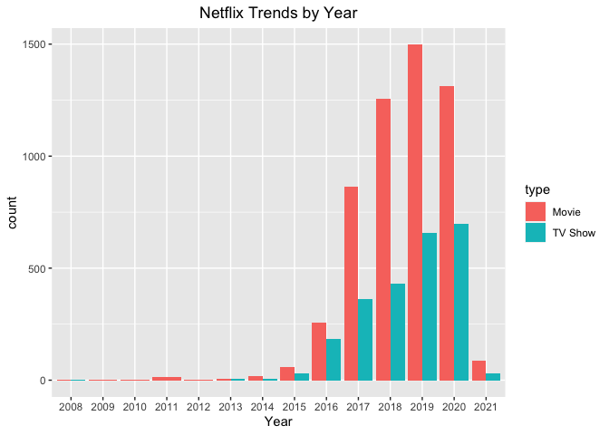
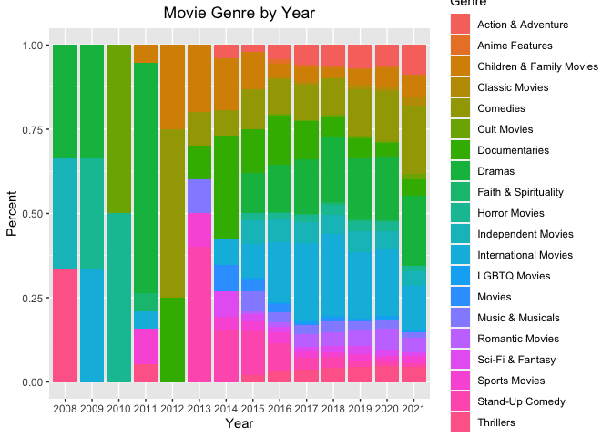
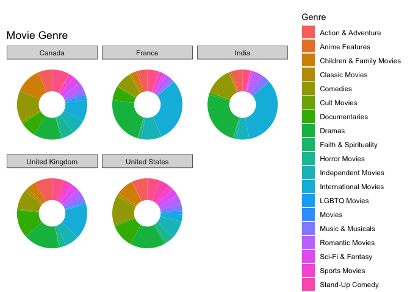
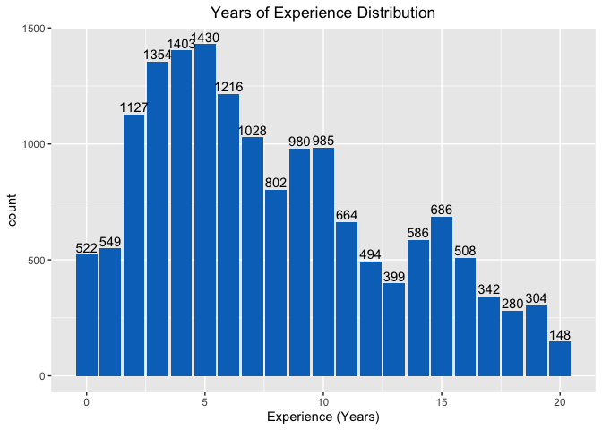
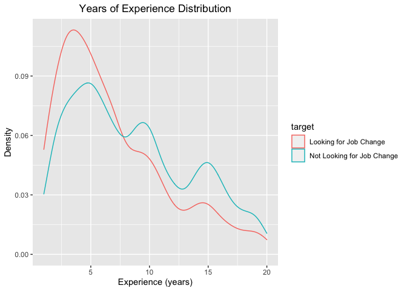
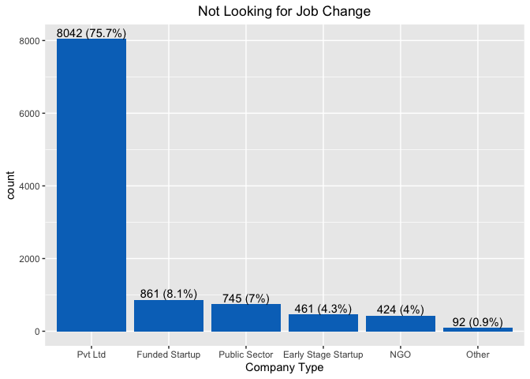

# Data Science Portfolio

This [GitHub Repository](https://github.com/hheejuice/Heeju_Portfolio) includes data analysis and machine learning exploration projects completed by Heeju Son who received a bachelor's degree in Economics from the University of Washington. Each project has been written in R using RStudio, then pushed to the GitHub repository.

README.md will highlight key findings of each data analysis projects. Codes and additional analysis are available in repository's subfolder. They also can be accessed by project title hyperlinks.

For better portfolio browsing experience, please check out [Portfolio](https://hheejuice.github.io/Heeju_Portfolio/).

## Contents
* ### Data Analysis and Visualization
  * [Netflix Analysis](Netflix-Analysis/Netflix-Analysis.md): Netflix has been growing very rapidly over the past few years. They have successfully expanded their business to over 190 countries internationally, and they are now producing many Netflix original contents. This project will investigate the trends in their library of movies and TV shows. 
  
      *Used Packages: tidyverse, dplyr, ggplot2, plotly, rworldmap*
      
      *Key findings:* Netflix has been focusing more on TV shows than on movies in recent years. The number of TV shows available on Netflix has been continuously increasing while the number of movies has been declining since 2019. Continent-wise, Netflix had a preference for movies from America - North and South America - over movies from other continents. This has been visualized by a map presented below. This project also shows that Netflix has made a lot of effort to promote diversity in their movie collection. A percentage stacked barchart for 'Movie Genre by Year' below shows that the percentage for international and LGBTQ films has been increasing since 2014. Out of top five countries by the number of movies on Netflix, France and India showed weaker genre diversity compared to US, UK, and Canada. Given the current trends, Netflix is very likely to increase genre variety in foreign movies in the near future.
  
      
  
       

  * [HR Analysis](HR-Analysis/HR-Analytics.md): dfsdfddd
  
      *Used Packages: tidyverse, dplyr, ggplot2, Hmisc, scales*

   \ 
  
   
  

  
  * [Credit Card Customer Analysis](Credit-card-customer/Credit-Card-Customers.md): outlier removal, data binning
  
      *Used Packages: tidyverse, dplyr, ggplot2, Hmisc, knitr, kableExtra*

* ### Machine Learning
  * [House Price Prediction Project using ML Linear Regression, K-Nearest Neighbors and Decision Tree](Housing-Price-Prediction/Housing-Price-Prediction.md): ndflnfln
    
      *Used Packages: caret, tree, class, psych, corrplot, psych*
      
  * [project using ML Logistic Regression](https://hheejuice.github.io/Heeju_Portfolio/): ndflnfln
  * [project using ML Classification](url): ndflnfln
  * Cluster Analysis
 
* ### Natural Language Processing
  * Tokenization
  * Stopword Removal
  * Lemmatization & Stemming
  https://monkeylearn.com/blog/nlp-ai/
